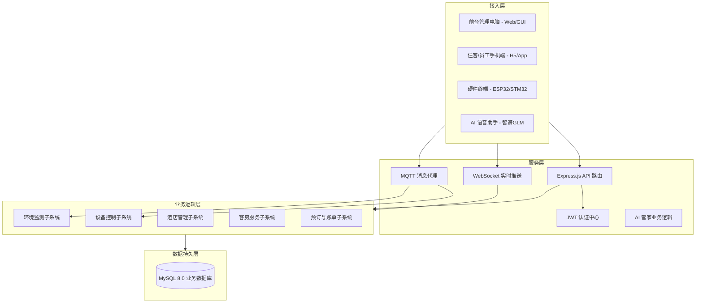

# 智慧酒店物联网控制系统 - 软件架构设计说明

## 📋 架构概述

本项目软件系统采用"云端/本地服务器 + 多端应用"的分布式架构，作为智慧酒店三层硬件架构的"中枢大脑"，实现对物联网设备的控制、环境数据的处理以及酒店业务流程的自动化管理。

### 架构设计原则
- **高可用性**：后端采用 Node.js 集群部署，支持高并发设备连接与请求处理。
- **实时性**：利用 MQTT 和 WebSocket 技术，确保设备状态变更和控制指令的毫秒级同步。
- **安全性**：全链路 JWT 认证、RBAC 角色访问控制、设备密钥校验及敏感数据加密。
- **可扩展性**：微服务化架构设计，支持 AI 模块、支付模块、第三方硬件接口的快速接入。
- **多端协同**：统一 API 后端，支持前台电脑、住客手机、员工手持端及 AI 语音助手同步交互。

### 🏗️ 系统逻辑架构图

---

## 🛠️ 技术栈选型

### 1️⃣ 后端技术 (iot-hotel-backend)
- **核心框架**：Node.js 20 + Express.js 4.18 + TypeScript 5.4
- **数据库**：MySQL 8.0 (mysql2/promise)
- **实时通信**：Socket.io 4.7 (WebSocket) + MQTT.js
- **人工智能**：智谱 AI GLM-4-Flash (NLP/Function Calling)
- **日志管理**：Winston + Morgan

### 2️⃣ 前端技术 (iot-hotel-web)
- **核心框架**：Vue 3.4 + Vite 5.2 + TypeScript 5.4
- **状态管理**：Pinia 2.1
- **路由管理**：Vue Router 4.3
- **UI 组件库**：Ant Design Vue 4.2
- **图表展示**：ECharts 5.5
- **通信协议**：Axios + Socket.io-client

### 3️⃣ 物联网通信
- **消息代理**：Eclipse Mosquitto (MQTT Broker)
- **设备端协议**：自定义串口通信帧 (USB 转串口) + MQTT Topic 订阅发布

---

## 📊 系统职责分工

| 系统端 | 主要职责 | 核心模块 |
|------|---------|---------|
| **后端 API** | 业务逻辑、数据中转、设备控制、AI 驱动 | 认证、设备管理、AI 逻辑、消息推送 |
| **前台管理端** | 酒店日常运营、房态监控、设备远程管理 | 接待中心、工单处理、数据统计、语音通话 |
| **住客移动端** | 手机控制客房、服务请求、在线自助入住 | 智能客房、AI 管家、在线入住、我的订单 |
| **集团管理端** | 全局运营概览、酒店管理、系统参数配置 | 集团总览、酒店管理、账户管理、系统设置 |
