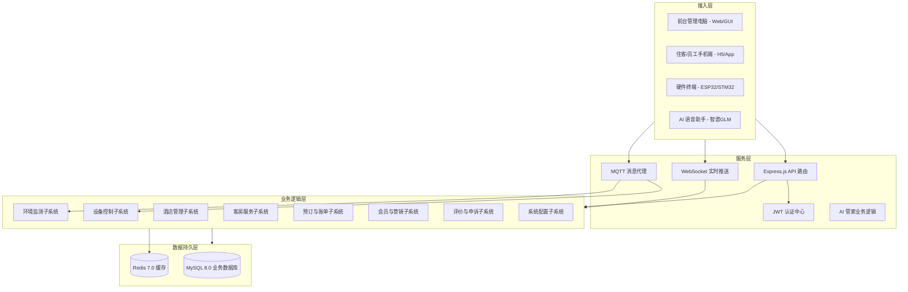

# 智慧酒店物联网控制系统 - 软件架构设计说明

## 📋 架构概述

本项目软件系统采用"云端/本地服务器 + 多端应用"的分布式架构，作为智慧酒店三层硬件架构的"中枢大脑"，实现对物联网设备的控制、环境数据的处理以及酒店业务流程的自动化管理。

### 架构设计原则
- **高可用性**：后端采用 Node.js 集群部署，支持高并发设备连接与请求处理。
- **实时性**：利用 MQTT 和 WebSocket 技术，确保设备状态变更和控制指令的毫秒级同步。
- **安全性**：全链路 JWT 认证、RBAC 角色访问控制、设备密钥校验及敏感数据加密。
- **可扩展性**：微服务化架构设计，支持 AI 模块、支付模块、第三方硬件接口的快速接入。
- **多端协同**：统一 API 后端，支持前台电脑、住客手机、员工手持端及 AI 语音助手同步交互。
- **多酒店支持**：系统支持多酒店管理，集团化运营。

### 🏗️ 系统逻辑架构图

---

## 🛠️ 技术栈选型

### 1️⃣ 后端技术 (iot-hotel-backend)
- **核心框架**：Node.js 20 + Express.js 4.18 + TypeScript 5.4
- **数据库**：MySQL 8.0 (mysql2/promise)
- **缓存**：Redis 7.0
- **实时通信**：Socket.io 4.7 (WebSocket) + MQTT.js
- **人工智能**：智谱 AI GLM-4-Flash (NLP/Function Calling)
- **日志管理**：Winston + Morgan
- **安全**：Helmet, CORS, Express-rate-limit

### 2️⃣ 前端技术 (iot-hotel-web)
- **核心框架**：Vue 3.4 + Vite 5.2 + TypeScript 5.4
- **状态管理**：Pinia 2.1
- **路由管理**：Vue Router 4.3
- **UI 组件库**：Ant Design Vue 4.2
- **图表展示**：ECharts 5.5
- **通信协议**：Axios + Socket.io-client

### 3️⃣ 物联网通信
- **消息代理**：Eclipse Mosquitto (MQTT Broker)
- **设备端协议**：自定义串口通信帧 (USB 转串口) + MQTT Topic 订阅发布
- **WebRTC**：用于语音通话

---

## 📊 系统职责分工

| 系统端 | 主要职责 | 核心模块 |
|------|---------|--------|
| **后端 API** | 业务逻辑、数据中转、设备控制、AI 驱动 | 认证、设备管理、AI 逻辑、消息推送、支付处理 |
| **前台管理端** | 酒店日常运营、房态监控、设备远程管理 | 接待中心、工单处理、数据统计、语音通话、价格管理 |
| **住客移动端** | 手机控制客房、服务请求、在线自助入住 | 智能客房、AI 管家、在线入住、我的订单、个人中心 |
| **集团管理端** | 全局运营概览、酒店管理、系统参数配置 | 集团总览、酒店管理、账户管理、系统设置、会员方案配置 |

---

## 📁 系统模块详细说明

### 1. 认证与授权模块
- **JWT 认证**：使用 JSON Web Token 进行身份验证，过期时间可配置
- **角色权限**：基于角色的访问控制（RBAC），支持系统管理员、酒店管理员、前台 staff、顾客四种角色
- **密码加密**：使用 bcrypt 进行密码哈希
- **经理授权**：特权操作需要经理授权校验

### 2. 酒店资源管理模块
- **酒店管理**：酒店基本信息管理、多酒店支持
- **房型管理**：房型定义、基础价格设置、图片管理
- **房间管理**：房间信息管理、状态更新、房间分配
- **楼层管理**：楼层信息管理、楼层平面图管理
- **价格日历**：实时价格和库存管理、动态价格调整

### 3. 业务订单系统模块
- **预订管理**：客房预订、订单状态管理、预订查询
- **入住管理**：在线入住、前台入住、身份验证
- **退房管理**：自动退房、手动退房、账单结算
- **支付管理**：支付请求处理、支付状态更新
- **续住管理**：续住价格计算、续住申请处理

### 4. 物联网设备控制模块
- **设备管理**：设备信息管理、状态监测、设备分组
- **远程控制**：设备控制指令下发、执行结果反馈
- **房卡管理**：房卡生成、发卡操作、权限管理
- **传感器数据**：环境数据采集、数据存储、数据分析

### 5. 客房服务系统模块
- **送物服务**：送物订单管理、状态更新、通知提醒
- **报修服务**：报修工单管理、优先级设置、处理跟踪
- **语音通话**：房间与前台通话、通话记录管理

### 6. AI 智能服务模块
- **智能客服**：自然语言处理、智能问答、服务请求处理
- **语音助手**：语音识别、语音合成、语音指令执行
- **知识库管理**：知识库维护、知识分类、知识更新

### 7. 会员与营销模块
- **会员管理**：会员信息管理、会员等级、积分管理
- **优惠券管理**：优惠券定义、发放、使用
- **会员方案**：会员等级配置、权益设置、积分规则

### 8. 评价与反馈模块
- **评价管理**：服务评价收集、评价统计、评价回复
- **申诉处理**：评价申诉管理、申诉审核、申诉处理

### 9. 系统配置模块
- **全局设置**：系统参数配置、会员方案配置
- **酒店个性化设置**：酒店特定配置、品牌设置

---

## 🔗 系统流程

### 1. 预订流程

1. 顾客浏览酒店及房型信息
2. 选择入住日期和房型
3. 填写预订信息并提交
4. 系统生成预订订单
5. 顾客支付定金或全款
6. 系统确认预订成功
7. 系统自动设置退房时间为退房日期中午12:00

### 2. 入住流程

1. 顾客到达酒店或在线办理入住
2. 前台验证身份信息或顾客在线提交身份信息
3. 系统分配房间并生成房卡
4. 顾客进入房间
5. 系统激活房间设备
6. 系统关联用户账号，设置自动退房时间

### 3. 设备控制流程

1. 用户（顾客或 staff）发出控制指令
2. 前端将指令发送至后端 API
3. 后端通过 MQTT 协议将指令下发至设备
4. 设备执行指令并返回执行结果
5. 后端更新设备状态并通知前端
6. 前端实时更新设备状态

### 4. 服务请求流程

1. 顾客通过房间终端或移动端发出服务请求
2. 系统接收并处理请求
3. 相关 staff 收到通知
4. staff 执行服务并更新状态
5. 系统通知顾客服务完成

### 5. AI 智能服务流程

1. 顾客通过语音或文本向 AI 管家发送请求
2. 系统接收并处理请求
3. AI 管家查询知识库获取相关信息
4. AI 管家生成响应并返回给顾客
5. 如需要执行操作，AI 管家调用相应的功能

---

## 📡 通信协议

### 1. 前端与后端

- **协议**：HTTP/HTTPS
- **数据格式**：JSON
- **认证**：JWT Token
- **实时通信**：WebSocket
- **API 基准路径**：`/api/v1`

### 2. 后端与设备

- **协议**：MQTT
- **主题格式**：`hotel/{hotel_id}/room/{room_id}/device/{device_id}/{action}`
- **消息格式**：JSON
- **MQTT 服务配置**：支持用户名密码认证

### 3. 设备与传感器

- **协议**：I2C、SPI、UART 等
- **数据格式**：二进制或自定义格式

### 4. WebSocket 事件

- **device_status_change**：设备在线/离线或状态变更提醒
- **new_order_notice**：收到新的预订或服务订单
- **emergency_alarm**：SOS 报警信息实时推送
- **voice_call_signal**：语音通话信令交换

---

## 🔒 安全设计

### 1. 认证与授权

- **JWT 认证**：使用 JSON Web Token 进行身份验证，过期时间可配置
- **角色权限**：基于角色的访问控制（RBAC），支持系统管理员、酒店管理员、前台 staff、顾客四种角色
- **密码加密**：使用 bcrypt 进行密码哈希
- **经理授权**：特权操作需要经理授权校验

### 2. 数据安全

- **数据传输加密**：使用 HTTPS 加密传输
- **敏感数据保护**：用户敏感信息加密存储
- **SQL 注入防护**：使用参数化查询
- **请求频率限制**：防止暴力破解和 DoS 攻击

### 3. 设备安全

- **设备认证**：设备接入时进行身份验证
- **通信加密**：MQTT 通信使用 TLS 加密
- **访问控制**：设备只能接收授权的指令
- **WebRTC 安全**：预留 TURN 服务器配置，应对防火墙和对称 NAT

---

## 📊 数据设计

### 1. 数据模型

系统采用关系型数据库设计，主要数据模型包括：

- **用户**：系统用户信息
- **酒店**：酒店基本信息
- **房型**：房间类型定义
- **房间**：具体房间信息
- **楼层**：楼层信息
- **预订**：预订订单信息
- **住客**：住客实名信息
- **支付**：支付流水信息
- **设备**：物联网设备信息
- **传感器数据**：环境传感器采集的数据
- **控制指令**：设备控制指令审计
- **送物订单**：送物服务订单
- **报修工单**：设备报修工单
- **通话记录**：语音通话记录
- **会员**：会员信息
- **优惠券**：优惠券定义
- **会员优惠券**：用户领券信息
- **AI 知识库**：AI 管家知识库
- **评价**：服务评价信息
- **评价申诉**：评价申诉信息
- **系统设置**：系统全局配置

### 2. 数据流程

1. 前端通过 API 与后端交互
2. 后端处理业务逻辑并与数据库交互
3. 设备通过 MQTT 与后端通信
4. 后端将设备数据存储到数据库
5. 前端从后端获取数据并展示
6. WebSocket 实时推送数据更新

---

## 🚀 部署与扩展

### 1. 部署架构

- **前端**：静态文件部署到 CDN 或 Web 服务器
- **后端**：容器化部署到云服务器，支持 Docker 部署
- **数据库**：MySQL 8.0，支持主从架构
- **MQTT 服务**：独立部署，支持设备通信
- **Redis**：缓存服务，用于会话管理和热点数据

### 2. 扩展性考虑

- **模块化设计**：系统采用模块化设计，便于功能扩展
- **微服务架构**：核心服务可拆分为独立的微服务
- **水平扩展**：支持多实例部署，应对高并发
- **设备接入**：支持多种物联网设备接入
- **多酒店支持**：系统支持多酒店管理，集团化运营

---

## 📈 性能优化

### 1. 前端优化

- **代码分割**：按需加载组件
- **缓存策略**：合理使用浏览器缓存
- **图片优化**：使用适当的图片格式和大小
- **减少请求**：合并请求，减少网络开销
- **WebSocket 复用**：建立长连接，减少连接开销

### 2. 后端优化

- **数据库索引**：合理设计数据库索引
- **缓存机制**：使用 Redis 缓存热点数据
- **异步处理**：使用异步操作处理耗时任务
- **负载均衡**：分布式部署，负载均衡
- **请求频率限制**：防止过度请求导致系统负载过高

### 3. 设备通信优化

- **消息队列**：使用消息队列处理设备消息
- **批量处理**：批量处理设备数据，减少网络传输
- **压缩传输**：压缩传输数据，减少带宽使用
- **MQTT QoS**：根据消息重要性设置不同的 QoS 级别

---

## 🛠️ 开发与维护

### 1. 开发流程

- **版本控制**：使用 Git 进行版本管理
- **代码规范**：遵循 TypeScript 和 Vue 最佳实践
- **测试策略**：单元测试、集成测试、端到端测试
- **CI/CD**：持续集成和部署
- **环境配置**：使用 .env 文件管理环境变量

### 2. 维护策略

- **监控系统**：实时监控系统运行状态
- **日志管理**：集中管理系统日志，使用 winston 日志库
- **故障处理**：快速响应和处理系统故障
- **性能分析**：定期分析系统性能，优化瓶颈
- **数据库维护**：定期备份和优化数据库

---

## 📝 结论

智慧酒店物联网控制系统采用现代化的技术栈和架构设计，为酒店提供了全面的智能化解决方案。系统具有良好的可扩展性、安全性和性能，能够满足酒店运营管理的各种需求。通过物联网技术和 AI 智能服务，系统不仅提高了酒店的运营效率，也提升了顾客的入住体验，为酒店行业的数字化转型提供了有力支持。

系统支持多角色、多酒店管理，具备完整的预订、入住、退房流程，以及设备控制、环境监测、客房服务等功能。同时，系统集成了 AI 智能服务，为顾客提供个性化的智能助手服务。

未来，系统可以进一步扩展更多智能设备接入，增强 AI 能力，以及开发更多数据分析和预测功能，为酒店运营提供更全面的支持。