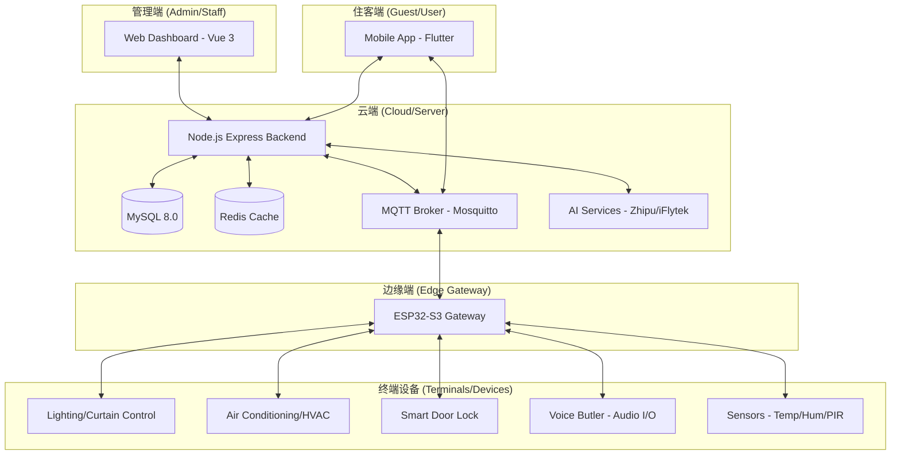
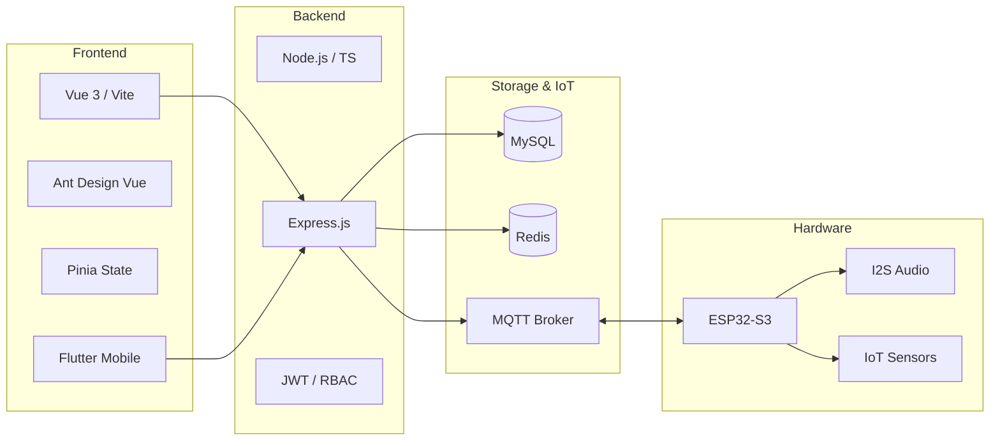
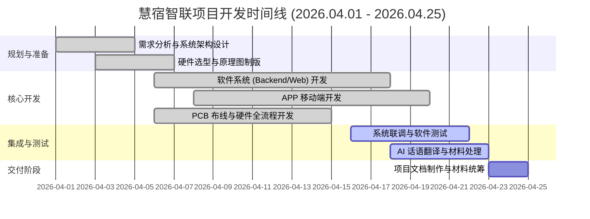

# 慧宿智联·云边端一体化智能酒店系统文档

## 一、项目需求 (Project Requirements)

### 1.1 项目背景
针对现代酒店数字化转型中“设备管理碎片化”、“服务响应延迟”、“住客交互单一”等痛点，本项目旨在构建一套全栈式的智能酒店物联网管理平台。通过云、边、端的高效协同，实现从线上预订、极速入住到客房智能控制、AI语音服务的全流程闭环。

### 1.2 核心需求
*   **多端协同管理**：支持 Web 后台、跨平台移动端（Flutter）及硬件终端的三方联动。
*   **物联网设备控制**：实现对客房灯光、空调、窗帘、门锁等设备的远程实时监测与控制。
*   **业务流程自动化**：覆盖预订、入住（支持在线/扫码）、退房、订单管理及房态自动同步。
*   **智能化交互**：集成 AI 语音识别（ASR）、语音合成（TTS）及大语言模型（LLM），提供客房语音管家服务。
*   **高可用架构**：采用 Redis 缓存高频状态，确保高并发下的系统稳定性。

---

## 二、系统设计 (System Design)

### 2.1 总体架构
*   **后端 (Backend)**：Node.js + Express + TypeScript，RESTful API 风格。
*   **前端 (Frontend)**：Vue 3 + Vite + Ant Design Vue + Pinia + ECharts。
*   **移动端 (Mobile)**：Flutter 跨平台架构（Android/iOS）。
*   **物联网通信 (IoT)**：MQTT 协议（Mosquitto）作为设备指令中枢。
*   **缓存与状态**：Redis 存储设备影子（Device Shadow）及 JWT 黑名单。

### 2.2 核心逻辑设计
*   **状态同步机制**：当订单状态变更为“已入住”时，系统通过数据库事务同步将房间状态设为“在住”，并通知 MQTT 激活房间控制权限。
*   **安全认证**：基于 JWT 的身份验证 + RBAC（基于角色的访问控制），区分系统管理员、酒店前台、住客等角色。

### 2.3 系统框架图 (System Architecture Diagram)



### 2.4 技术栈说明图 (Tech Stack Visualization)



---

## 三、数据库设计 (Database Design)

系统采用 MySQL 8.0 作为核心关系型数据库，设计上遵循 **“多租户隔离（酒店维度）”** 与 **“业务-设备解耦”** 的原则。

### 3.1 核心业务模块

#### 3.1.1 酒店与客房基础表
*   **`hotels`**：存储门店基础信息。
    - `id`, `hotel_name`, `hotel_star`, `location`, `rating` (综合评分), `image_url` (封面图)。
*   **`room_types`**：房型模板配置。
    - `id`, `hotel_id` (0为集团公用), `name`, `code` (房型编码), `base_price` (基准价), `facilities` (配套设施 JSON), `images` (展示图 JSON)。
*   **`rooms`**：具体客房实体。
    - `id`, `hotel_id`, `room_number`, `room_type_id`, `room_status` (空闲/在住/维修/待扫), `floor`, `room_price` (实时房价)。

#### 3.1.2 预订与交易表
*   **`bookings`**：核心订单表。
    - `id`, `booking_number` (BK+日期+随机码), `hotel_id`, `room_id`, `guest_name`, `guest_phone`, `check_in_date`, `check_out_date`, `status` (待确认/已确认/已入住/已退房/已取消), `total_price`。
*   **`payments`**：流水支付记录。
    - `id`, `payment_no`, `order_id`, `amount`, `payment_method` (微信/余额/模拟), `status` (待支付/已支付)。
*   **`room_prices`**：动态价格日历表，用于支持不同日期的价格浮动。

#### 3.1.3 用户与权限表
*   **`users`**：后台管理账号。
    - `id`, `username`, `password` (BCrypt 加密), `role` (admin/manager/staff/customer), `hotel_id` (数据隔离关键字段)。
*   **`members`**：C 端住客会员资产表。
    - `id`, `phone`, `member_level` (标准/银卡/金卡/钻石), `points` (积分), `balance` (余额)。

### 3.2 物联网与 AI 模块

#### 3.2.1 IoT 设备表
*   **`devices`**：登记所有接入的硬件终端（ESP32 主控）。
    - `id`, `device_id` (唯一硬件码), `device_type` (前台/楼控/客房), `device_status` (在线/离线), `last_seen` (最后心跳时间)。
*   **`sensor_data`**：传感器历史记录。
    - `id`, `device_id`, `sensor_type` (温度/湿度/PM2.5), `sensor_value`。
*   **`rfid_cards`**：智能房卡管理。
    - `card_uid`, `room_id`, `status` (激活/挂失/失效)。

#### 3.2.2 AI 与服务表
*   **`ai_knowledge_entries`**：AI 管家本地知识库。
    - `category` (酒店信息/政策/FAQ), `question`, `answer`, `keywords` (检索标签)。
*   **`ai_conversations`**：住客与 AI 的交互对话历史，用于意图分析与服务质量审计。
*   **`maintenance_tickets`**：报修工单表。
    - `ticket_no`, `room_id`, `fault_type`, `priority`, `repairer` (分配人员), `status` (待处理/处理中/已完成)。

### 3.3 数据关联说明 (ER Highlights)
1.  **酒店维度隔离**：绝大多数业务表（`rooms`, `bookings`, `users`）均包含 `hotel_id` 字段，确保多门店数据物理同库、逻辑隔离。
2.  **状态强一致性**：通过 `bookings.status` 与 `rooms.room_status` 的业务触发器/事务逻辑，保证客房状态实时跟随业务流程（预订、入住、退房）流转。
3.  **高性能检索**：针对高频查询的 `booking_number`, `device_id`, `phone` 字段均建立了唯一索引（UNIQUE KEY）；针对 `room_status`, `hotel_id` 等建立了 B-Tree 索引以提升列表加载速度。

---

## 四、接口文档摘要 (API Interface)

### 4.1 认证模块 (`/api/v1/auth`)
*   `POST /login`：用户手机号密码登录。
*   `POST /scan-login`：移动端扫码安全登录。
*   `POST /generate-token`：生成临时 API 凭证。

### 4.2 业务管理 (`/api/v1/bookings`, `/api/v1/rooms`)
*   `GET /bookings`：获取预订列表（支持按酒店、状态过滤）。
*   `PATCH /bookings/:id/status`：更新订单状态（含房态联动）。
*   `PATCH /rooms/:id/status`：手动切换房间房态。
*   `POST /room-types`：创建/管理房型定义。

---

## 五、测试方案 (Testing)

### 5.1 功能测试用例
1.  **预订联动测试**：模拟住客下单，验证 `bookings` 增加记录后，前台“今日预定清单”是否即时显示。
2.  **入住同步测试**：办理入住操作，检查 `rooms` 表状态是否从 `available` 变为 `occupied`。
3.  **权限越权测试**：尝试用住客 Token 访问 `/api/v1/users` 接口，验证是否返回 403。

### 5.2 性能测试
*   **数据库连接池**：验证在 1000 次/分钟的高频请求下，配置了 `connectTimeout` 的 MySQL 连接池是否能稳定维持。
*   **Redis 命中率**：监测设备影子数据的缓存命中情况，降低对主库的压力。

---

## 六、用户手册 (User Manual)

### 6.1 管理员端 (Management Terminal)
*   **酒店资源配置**：
    *   **房型管理**：在“房型管理”中定义不同档次的客房（如豪华双人房、总统套房），上传精美展示图，并设置不同季节的基准房价。
    *   **房间初始化**：批量生成房间号，并将其关联至对应的楼层与房型。
*   **运营决策支持**：
    *   **数据看板**：实时监控全店入住率、当日预定量、实时营收及设备健康度（故障统计）。
    *   **工单调度**：接收客房报修请求，手动或自动指派维修人员，跟踪处理进度。

### 6.2 前台端 (Reception Terminal)
*   **接待中心核心业务**：
    *   **今日预定清单**：自动筛选今日抵达的客人，点击“办理入住”即可一键提取住客预留信息，快速完成身份登记。
    *   **房态沙盘**：通过网格化色块（绿-空闲、蓝-预订、红-在住、黄-待扫、灰-故障）实时调度全店客房。
*   **客房服务响应**：
    *   **语音呼叫处理**：实时接收住客通过 AI 终端发起的语音通话请求，直接在 Web 端进行双向语音对讲。
    *   **配送请求管理**：查看住客申请的饮品、毛巾等送物请求，标记处理状态。

### 6.3 住客端 (Guest/User Terminal)
住客端旨在提供全流程的自助化、智能化入住体验。

#### 6.3.1 预订与入住流程
1.  **极速搜索**：在首页通过目的地、日期及人数搜索酒店，系统将基于 Redis 缓存秒级返回可用酒店列表。
2.  **房型比选**：进入酒店详情页查看全景图、住客真实评价及详细房型方案（含早餐/取消政策）。
3.  **在线预订**：填写联系人信息并确认订单，支持多种模拟支付方式。
4.  **云端入住 (Online Check-in)**：在抵达酒店前，通过“我的预订”进入在线入住页面，提交身份信息，审核通过后即可获得房间临时 PIN 码，实现“到店即入住”。

#### 6.3.2 智慧客房体验
1.  **AI 智慧管家 (AI Butler)**：
    *   **自然语言交互**：点击“AI管家”，可通过文字或语音指令操控客房（如：“小智，帮我打开空调并调至26度”）。
    *   **智能查询**：咨询酒店 WiFi 密码、早餐时间或周边景点推荐。
2.  **IoT 智能控制**：
    *   通过快捷按钮一键切换“睡眠模式”（关闭灯光、拉上窗帘、空调静音）或“观影模式”。
3.  **全方位客房服务**：
    *   **送物申请**：在线勾选饮品、日用品或餐食，实时查看机器人或人工配送进度。
    *   **一键报修**：若房间设备异常，可拍照并提交报修工单，系统将自动通知工程部。
    *   **呼叫前台**：直接发起在线音频通话，无需拿起传统的座机电话。
4.  **评价反馈**：离店后可对本次入住的硬件设施、AI 体验及服务质量进行星级评价。

---

## 七、部署手册 (Deployment)

### 7.1 环境要求
*   **Node.js** >= 20.x
*   **Docker Desktop** (用于 MySQL, Redis, MQTT)

### 7.2 一键初始化
运行项目根目录下的脚本：
```powershell
.\init_local_env.ps1
```
该脚本会自动：
1. 拉起 Docker 中间件容器。
2. 自动创建并初始化 MySQL 表结构及测试数据。
3. 安装前后端所有 `npm` 依赖。

### 7.3 启动服务
*   **后端**：`cd backend/iot-hotel-backend && npm run dev`
*   **前端**：`cd frontend/iot-hotel-web && npm run dev`

---

## 八、 展示材料清单 (Presentation Materials Checklist)
> **负责人**：谢敏涛（后勤组长）  
> **核心任务**：整理并校验所有技术文档与展示辅助材料，确保演示时文件可正常打开、内容完整且符合最新版本要求。

### 8.1 核心技术文档 (Documentation Set)
*   [x] **项目需求文档**：涵盖背景、痛点分析及功能矩阵。
*   [x] **系统设计文档**：包含总体架构、逻辑设计及安全策略。
*   [x] **数据库设计文档**：ER 图、表结构定义及索引优化说明。
*   [x] **接口文档**：基于 RESTful 标准的 API 规范说明（含测试 URL）。
*   [x] **测试文档**：测试用例、Bug 清单及测试总结报告。
*   [x] **用户手册**：管理员、前台及住客三端操作指南。
*   [x] **部署文档**：环境准备、一键初始化及启动手册。

### 8.2 演示辅助材料 (Presentation Aids)
*   [x] **项目介绍 PPT**：用于整体路演与核心亮点展示。
*   [x] **系统架构图**：云边端协同架构可视化。
*   [x] **技术栈说明图**：全栈技术选型矩阵。
*   [x] **项目时间线/里程碑**：研发周期与关键节点甘特图。
*   [x] **团队分工表**：成员职责与产物对应表。

---

## 九、 录制讲解提纲 (Recording Outline)

1.  **开场与定位**：简述作为后勤组长对项目全生命周期文档的管理与归档。
2.  **技术文档展示**：快速切换展示需求、设计、数据库及接口文档，强调文档的系统性与专业性。
3.  **用户手册与部署**：重点展示“一键部署”脚本说明与多角色用户手册，体现项目的易用性与交付能力。
4.  **辅助材料总结**：展示团队分工与里程碑甘特图，体现项目的工程化管理水平与团队协同效率。

---

## 十、 项目里程碑与团队分工 (Project Milestones & Team)

### 10.1 项目里程碑 (Project Milestones)



### 10.2 演示团队分工 (Team Roles) - 5人精简版

| 姓名 | 分工 | 演示内容 | 时长 |
| :--- | :--- | :--- | :--- |
| **方奕铸** | 原理图设计 | 电路原理图、PCB设计、BOM清单展示 | 3分钟 |
| **向前** | 硬件开发 | 硬件模块演示、传感器、执行器联动展示 | 5分钟 |
| **姚肇杰** | APP前端开发 | 移动端APP功能演示、设备控制、场景模式 | 4分钟 |
| **钟昊** | Web前端开发 | 后台管理系统演示、数据可视化、房态管理 | 4分钟 |
| **陈剑涛** | 后端开发 | API接口演示、数据库架构、性能测试展示 | 3分钟 |

**总演示时长**：约19分钟
