# 智慧酒店物联网控制系统 - 数据库 E-R 图设计

> 版本: v2.0.0
> 更新日期: 2026-04-16
> 适用范围: 后端服务、Web前端、App端、硬件接口

---

## 一、核心实体分类总览

系统采用 **6大模块** 设计，共 **40张核心表**（新增12张）：

| 模块 | 表数量 | 核心功能 |
|------|--------|----------|
| 用户与权限 | 7 | 四角色模型、扫码登录、会话管理 |
| 酒店与房间 | 8 | 酒店管理、房型、场景配置、房卡 |
| 预订与入住 | 4 | 预订、入住、支付、常住客 |
| 会员与营销 | 6 | 会员体系、优惠券、评价、申诉 |
| IoT物联网 | 9 | 设备控制、传感器、通话、MQTT、安防 |
| 客房服务 | 3 | 送物、维修工单、角色申请 |

---

## 二、E-R 关系总图

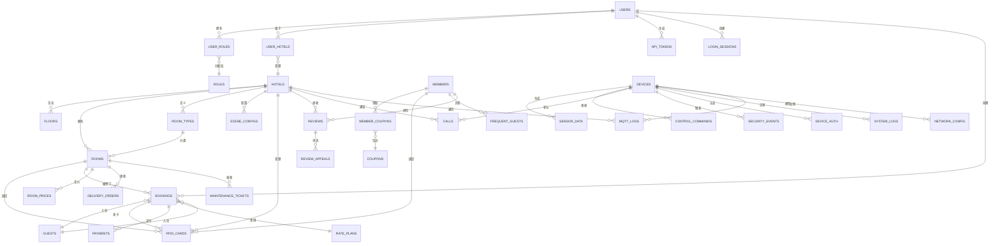

---

## 三、实体关系详细图

### 3.1 用户与权限模块

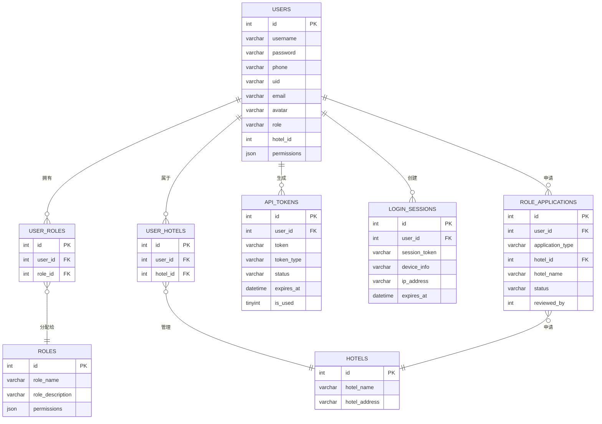

| 表名 | 说明 | 主键 | 外键 |
|------|------|------|------|
| **users** | 用户信息 | id | - |
| **roles** | 角色定义 | id | - |
| **user_roles** | 用户-角色关联 | id | user_id, role_id |
| **user_hotels** | 用户-酒店关联 | id | user_id, hotel_id |
| **api_tokens** | API令牌/扫码登录 | id | user_id |
| **login_sessions** | 登录会话 | id | user_id |
| **role_applications** | 角色申请 | id | user_id, hotel_id |

**角色定义**

| role_name | 中文名称 | hotel_id 规则 |
|-----------|----------|---------------|
| `system_admin` | 系统管理员 | `0` (不属于任何酒店) |
| `hotel_admin` | 酒店管理员 | `>0` (所属酒店ID) |
| `staff` | 前台员工 | `>0` (所属酒店ID) |
| `customer` | 顾客 | `NULL` 或 `0` |

**扫码登录状态流转**

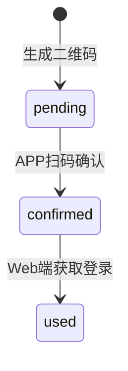

---

### 3.2 酒店与房间模块

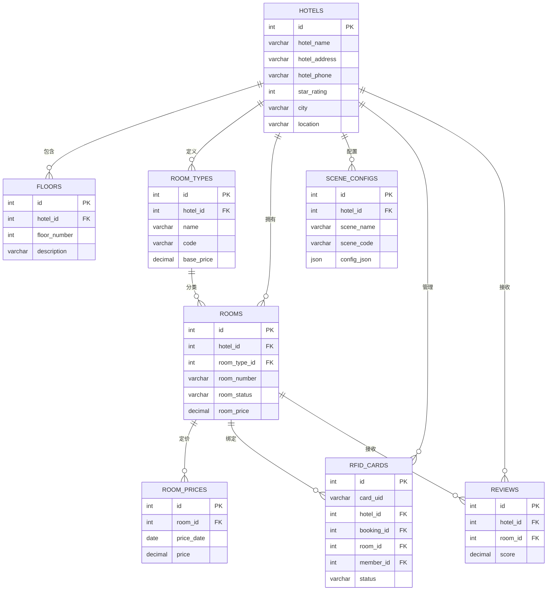

| 表名 | 说明 | 主键 | 外键 |
|------|------|------|------|
| **hotels** | 酒店信息 | id | - |
| **floors** | 楼层信息 | id | hotel_id |
| **room_types** | 房型字典 | id | hotel_id |
| **rooms** | 房间信息 | id | hotel_id, room_type_id |
| **room_prices** | 动态价格日历 | id | room_id |
| **scene_configs** | 场景配置 | id | hotel_id |
| **rfid_cards** | 房卡管理 | id | hotel_id, booking_id, room_id, member_id |

**房间状态流转**

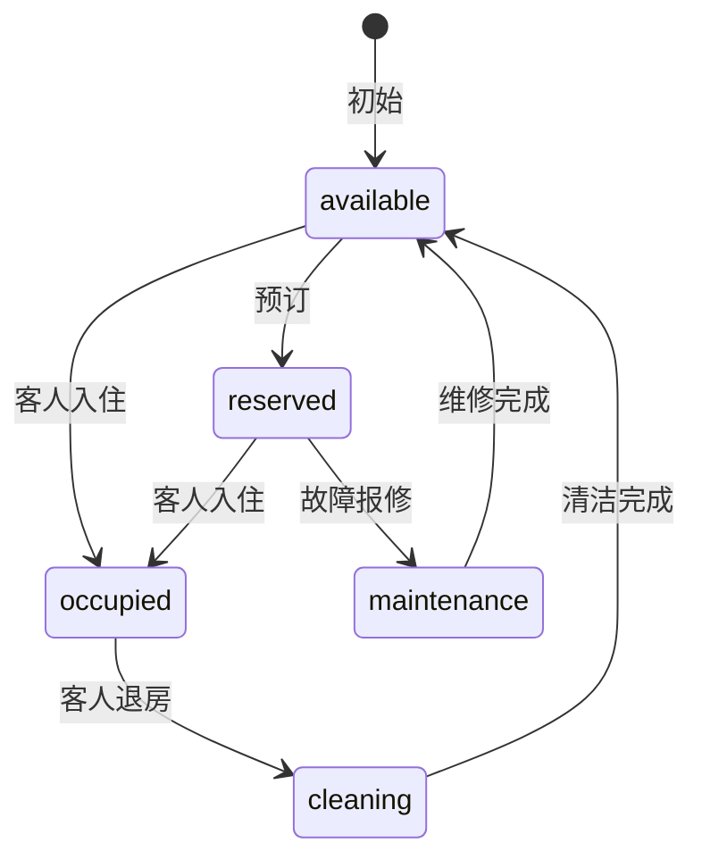

---

### 3.3 预订与入住模块

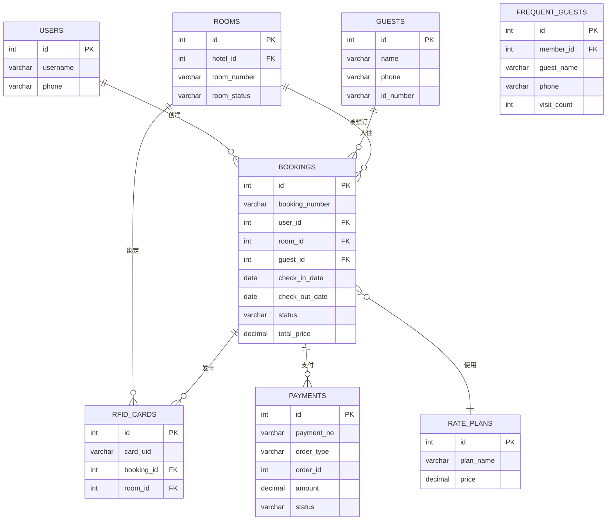

| 表名 | 说明 | 主键 | 外键 |
|------|------|------|------|
| **guests** | 入住宾客 | id | - |
| **bookings** | 预订记录 | id | user_id, room_id, guest_id |
| **payments** | 支付记录 | id | - |
| **rate_plans** | 价格方案 | id | - |
| **frequent_guests** | 常住客信息 | id | member_id |

**预订状态流转**

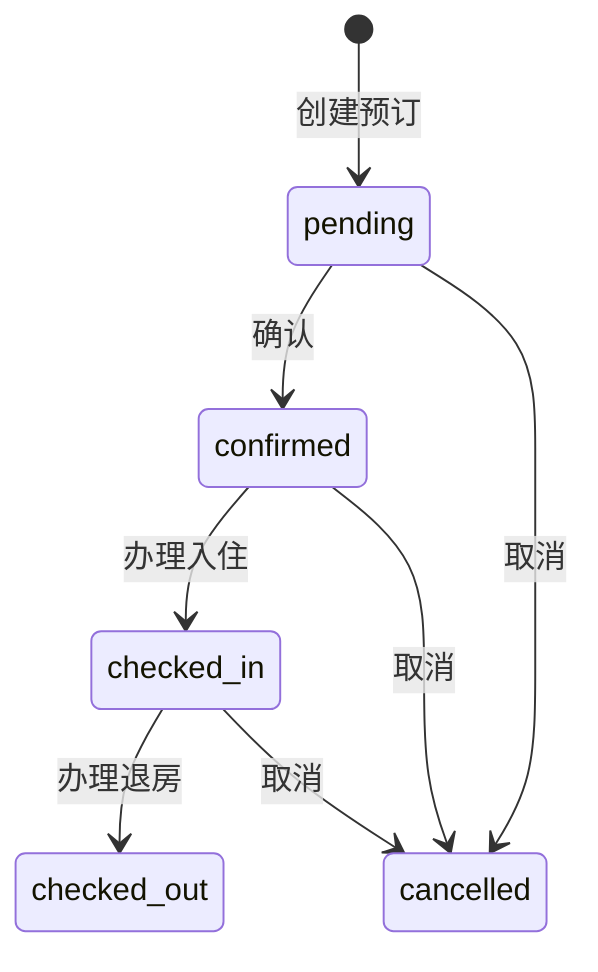

---

### 3.4 会员与营销模块

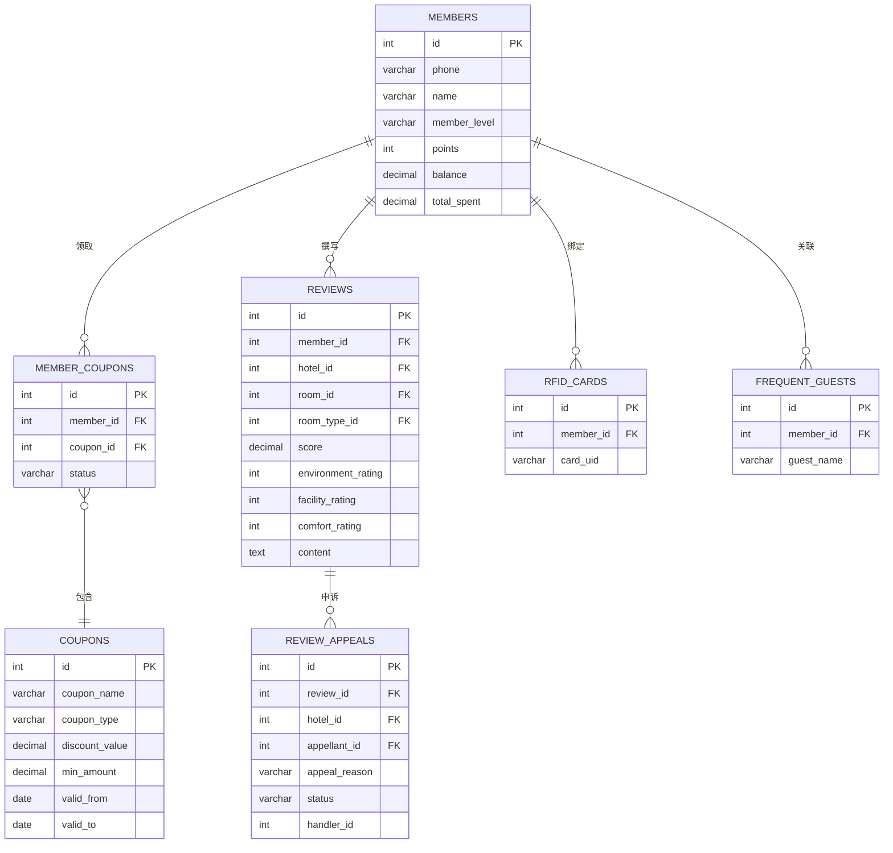

| 表名 | 说明 | 主键 | 外键 |
|------|------|------|------|
| **members** | 会员信息 | id | - |
| **coupons** | 优惠券 | id | - |
| **member_coupons** | 会员-优惠券关联 | id | member_id, coupon_id |
| **reviews** | 评价 | id | member_id, hotel_id, room_id |
| **review_appeals** | 评价申诉 | id | review_id, hotel_id |
| **frequent_guests** | 常住客信息 | id | member_id |

**会员等级**

| level | 中文名称 | 累计消费 |
|-------|----------|----------|
| `standard` | 普通会员 | 0 |
| `silver` | 银卡会员 | ≥1000 |
| `gold` | 金卡会员 | ≥5000 |
| `platinum` | 白金会员 | ≥10000 |

---

### 3.5 IoT 物联网模块

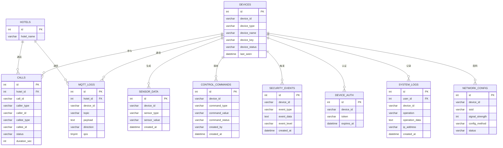

| 表名 | 说明 | 主键 | 外键 |
|------|------|------|------|
| **devices** | IoT设备 | id | - |
| **sensor_data** | 传感器数据 | id | - |
| **control_commands** | 控制指令 | id | - |
| **calls** | 语音通话记录 | id | hotel_id |
| **security_events** | 安防事件 | id | - |
| **device_auth** | 设备认证 | id | - |
| **system_logs** | 系统日志 | id | user_id |
| **network_config** | 配网记录 | id | - |
| **mqtt_communication_logs** | MQTT通信日志 | id | hotel_id |

**设备类型**

| device_type | 说明 |
|-------------|------|
| `main` | 前台管理端 |
| `sub1` | 楼控设备 |
| `sub2` | 客房端设备 |

**通话类型**

| caller_type/callee_type | 说明 |
|--------------------------|------|
| `room` | 房间设备 |
| `front_desk` | 前台 |
| `ai` | AI助手 |
| `app` | 手机App |

---

### 3.6 客房服务模块

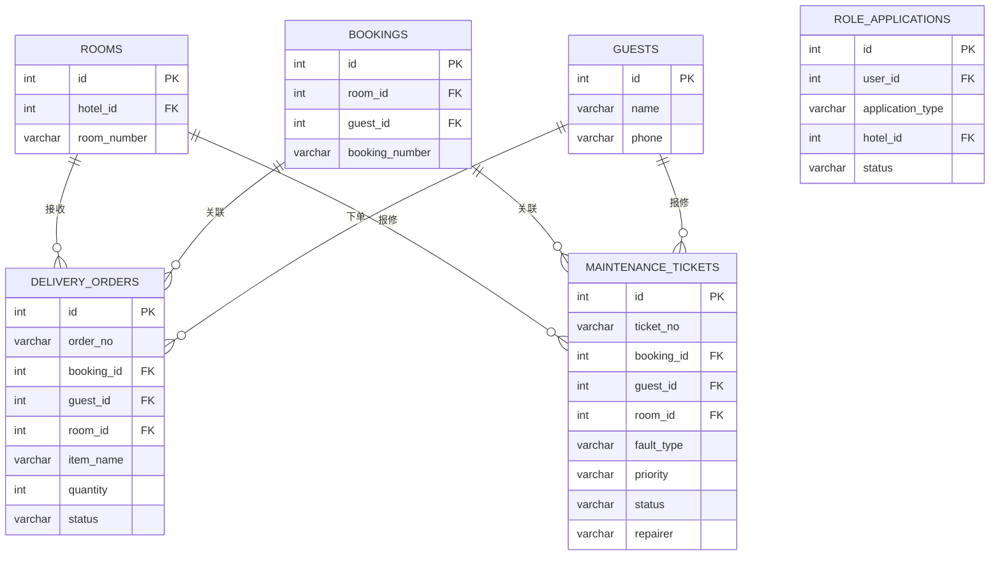

| 表名 | 说明 | 主键 | 外键 |
|------|------|------|------|
| **delivery_orders** | 客房送物 | id | booking_id, guest_id, room_id |
| **maintenance_tickets** | 维修工单 | id | booking_id, guest_id, room_id |
| **role_applications** | 角色申请 | id | user_id, hotel_id |

**送物订单状态流转**

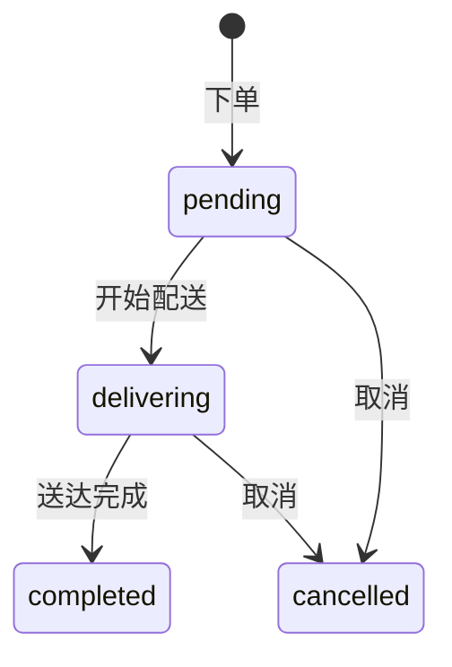

**维修工单状态流转**

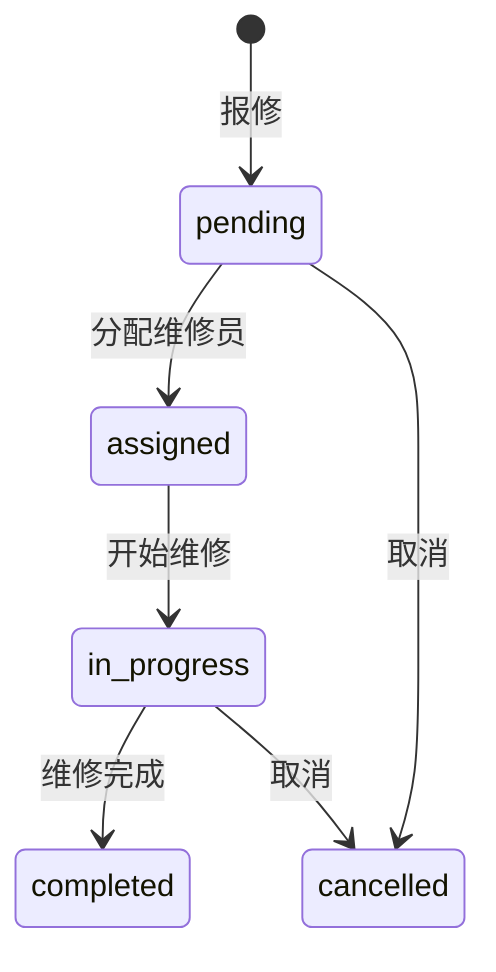

**角色申请类型**

| application_type | 说明 |
|------------------|------|
| `create_hotel` | 创建酒店申请 |
| `bind_employee` | 绑定员工申请 |

---

## 四、状态机流转图

### 4.1 房间状态流转


### 4.2 预订状态流转


### 4.3 送物订单状态流转


### 4.4 维修工单状态流转


### 4.5 支付状态流转

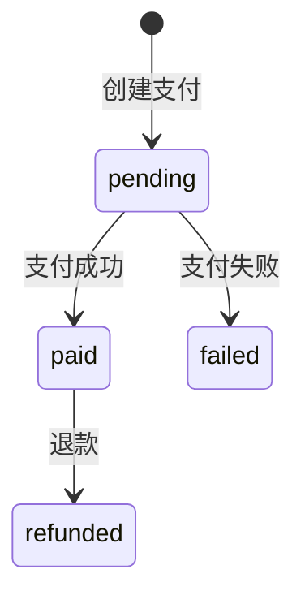

### 4.6 扫码登录状态流转


### 4.7 评价申诉状态流转

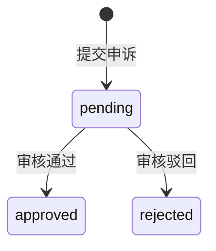

---

## 五、设计模式总结

### 5.1 多对多关联

通过中间表实现灵活的多对多关系：

```sql
-- 用户-角色
user_roles (user_id, role_id)

-- 用户-酒店
user_hotels (user_id, hotel_id)

-- 会员-优惠券
member_coupons (member_id, coupon_id)
```

### 5.2 外键约束

通过外键维护数据完整性：

```sql
-- 房间必须属于某个酒店
rooms.hotel_id → hotels.id

-- 预订必须关联某个房间
bookings.room_id → rooms.id

-- 房型可按酒店隔离
room_types.hotel_id → hotels.id
```

### 5.3 多态关联

通过 `order_type + order_id` 实现通用关联：

```sql
-- payments 表
payments (order_type ENUM('booking', 'delivery'), order_id INT)

-- reviews 表
reviews (order_type ENUM('booking'), order_id INT)
```

---

## 六、命名规范

### 6.1 表命名

- 小写蛇形命名法（snake_case）
- 使用复数形式：`users`, `rooms`, `bookings`
- 关联表使用双表名：`user_roles`, `user_hotels`

### 6.2 字段命名

| 前缀/后缀 | 用途 | 示例 |
|-----------|------|------|
| `_id` | 外键 | `user_id`, `hotel_id` |
| `_at` | 时间戳 | `created_at`, `updated_at` |
| `_date` | 日期 | `check_in_date` |
| `_count` | 计数 | `guest_count`, `review_count` |
| `_number` | 编号 | `booking_number`, `order_no` |
| `is_` | 布尔 | `is_used`, `is_active` |

### 6.3 索引命名

| 类型 | 前缀 | 示例 |
|------|------|------|
| 唯一索引 | `uk_` | `uk_booking_number` |
| 普通索引 | `idx_` | `idx_bookings_user_id` |
| 联合索引 | `idx_` | `idx_device_sensor` |

---

## 七、冗余字段与优化建议

| 表 | 冗余字段 | 建议处理 |
|----|----------|----------|
| hotels | `hotel_star` | 统一为 `star_rating` |
| hotels | `location` | 统一为 `hotel_address` |
| rooms | `room_type` (VARCHAR) | 统一使用 `room_type_id` |
| rooms | `image_url` | 统一使用 `images` (JSON) |

---

## 八、测试账号

| 账号 | 手机号 | 密码 | 角色 |
|------|--------|------|------|
| admin2 | 13800000003 | admin123 | system_admin |
| admin1 | 13800000005 | admin123 | hotel_admin |
| reception_01 | 13800000001 | reception123 | staff |
| reception_02 | 13800000002 | reception123 | staff |
| yyzzjj | 13800000004 | 123123 | customer |

---

## 九、版本历史

| 版本 | 日期 | 更新内容 |
|------|------|----------|
| v2.0.0 | 2026-04-16 | 新增12张表：rfid_cards, scene_configs, mqtt_logs, review_appeals, security_events, device_auth, system_logs, network_config, api_tokens, login_sessions, role_applications, frequent_guests |
| v1.0.0 | 2026-04-16 | 初始文档，完整 E-R 图设计 |
