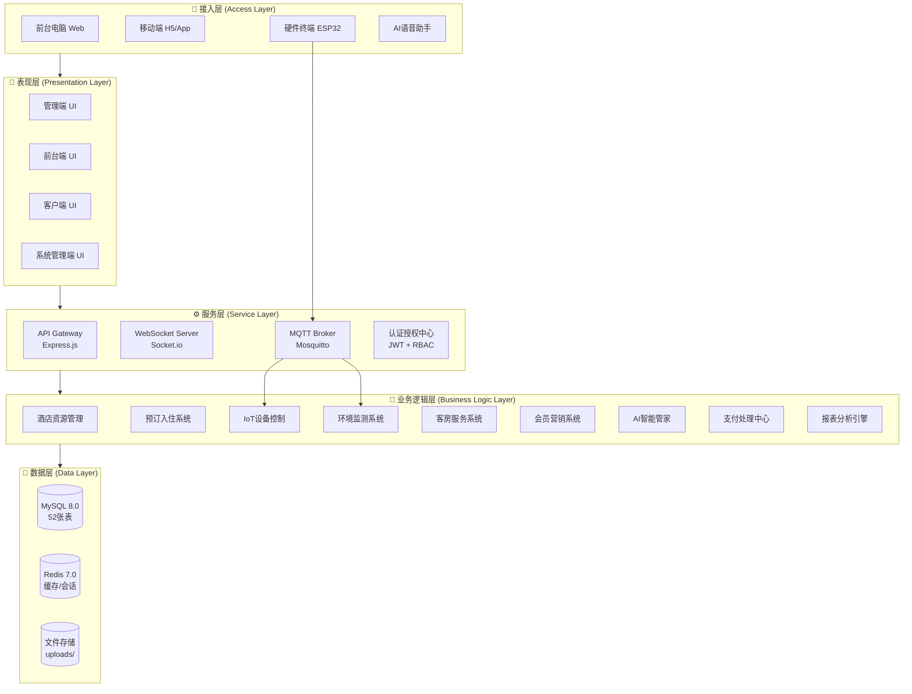
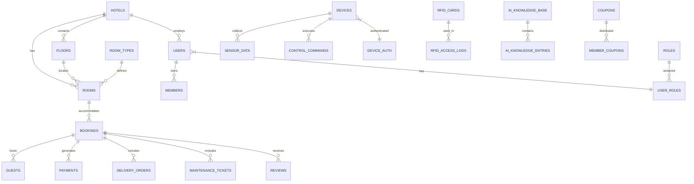
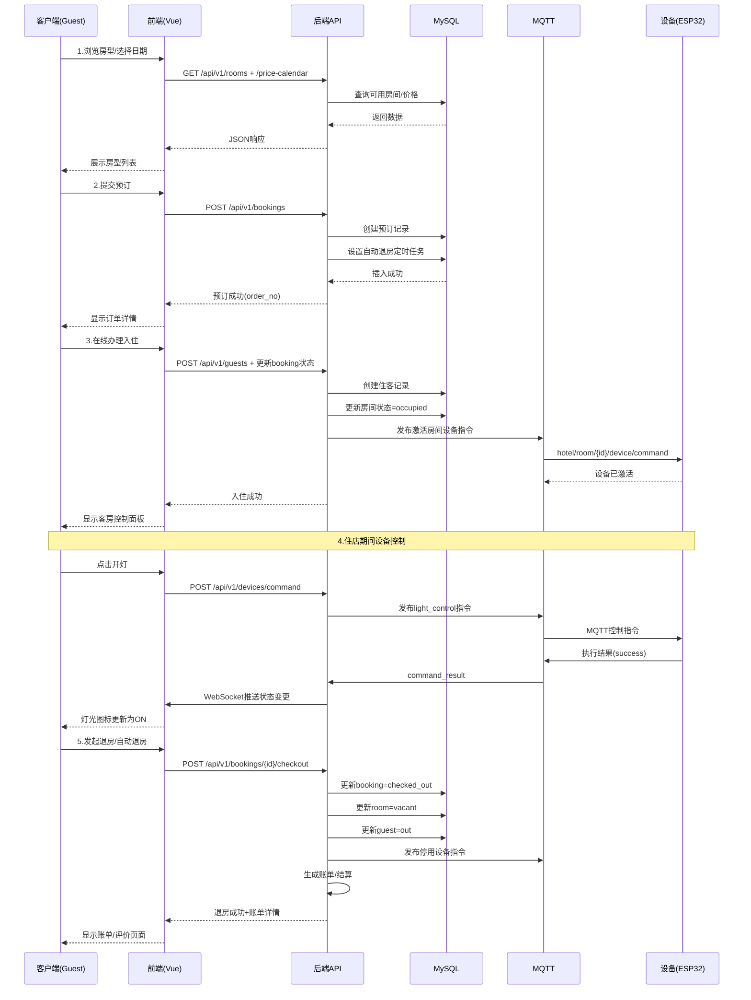
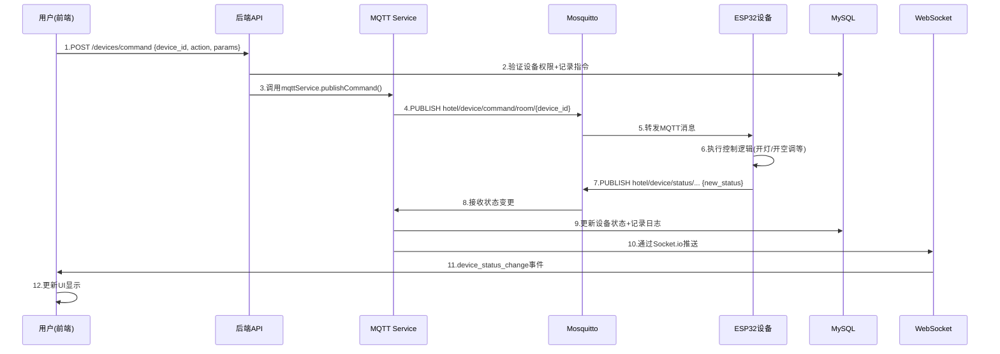
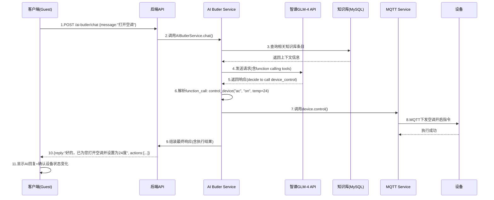
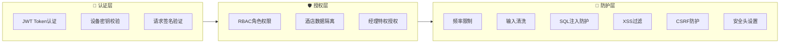

# 慧宿智联·云边端一体化智能酒店物联网设备管理与服务全栈解决方案

## 📋 系统架构文档 (v2.2.0)

**更新日期**: 2026-04-23  
**文档版本**: v2.2.0  
**项目代号**: IoT_Smart_Hotel_System

---

## 目录

1. [项目概述](#1-项目概述)
2. [整体架构](#2-整体架构)
3. [技术栈详细说明](#3-技术栈详细说明)
4. [系统模块详解](#4-系统模块详解)
5. [数据库设计](#5-数据库设计)
6. [通信协议与数据流](#6-通信协议与数据流)
7. [安全架构](#7-安全架构)
8. [部署架构](#8-部署架构)
9. [性能优化策略](#9-性能优化策略)
10. [开发规范](#10-开发规范)

---

## 1. 项目概述

### 1.1 项目定位

慧宿智联是一个**云边端一体化智能酒店物联网设备管理与服务全栈解决方案**，采用创新的"云端-边缘-设备端"三层架构，实现：

- **三端协同**：管理端 · 前台端 · 客户端 无缝协作
- **AI赋能**：集成智谱GLM-4 AI大模型，提供智能客房管家服务
- **IoT互联**：实时监控和控制酒店物联网设备
- **多酒店支持**：集团化管理，支持多分店运营

### 1.2 核心特性

#### 软件系统特性 (v2.2.0)

| 特性类别 | 功能描述 | 技术实现 |
|---------|---------|---------|
| **三端协同界面** | 管理端/前台端/客户端统一交互 | Vue 3 + Ant Design Vue |
| **实时通信** | 设备状态毫秒级同步 | MQTT + WebSocket (Socket.io) |
| **AI智能服务** | 自然语言处理、智能问答、语音交互 | 智谱 GLM-4-Flash API |
| **设备管理** | IoT设备注册、监控、控制、固件升级 | MQTT + 自定义协议 |
| **环境监测** | 温湿度、光照、空气质量实时采集 | ESP32传感器 + MQTT上报 |
| **语音通话** | 房间-前台-AI多方通话 | WebRTC + Socket.io信令 |
| **RFID门禁** | 房卡管理、刷卡开门、权限控制 | RFID-RC522 + MQTT指令 |
| **会员营销** | 会员等级、积分、优惠券体系 | 完整CRUD + 规则引擎 |

#### 最新功能更新 (2026-04-07 ~ 2026-04-23)

1. **送物订单增强**
   - 新增 `booking_id` 字段：关联预订信息
   - 新增 `guest_id` 字段：关联住客信息
   - 支持按预订/住客维度查询送物记录

2. **报修工单增强**
   - 支持预订和住客关联
   - 多维度筛选：按预订、住客、房间查询

3. **住客管理系统（全新）**
   - 完整CRUD操作
   - 身份证件管理
   - 入住状态跟踪（in/out）

4. **语音通话系统（已完善）**
   - 多方通话支持（房间、前台、AI、APP）
   - 完整状态机管理
   - 历史记录与统计分析

---

## 2. 整体架构

### 2.1 云边端一体化架构图

```
┌─────────────────────────────────────────────────────────────────────┐
│                        ☁️ 云端层 (Cloud Layer)                       │
│  ┌─────────────┐  ┌─────────────┐  ┌─────────────┐  ┌────────────┐ │
│  │  AI大脑     │  │  数据中台    │  │  管理平台    │  │  通信中枢  │ │
│  │ GLM-4 NLP   │  │ 运营分析     │  │ 多酒店管理  │  │ MQTT+WS   │ │
│  └──────┬──────┘  └──────┬──────┘  └──────┬──────┘  └─────┬────┘ │
│         │                │                │               │       │
│  ┌──────┴────────────────┴────────────────┴───────────────┴────┐  │
│  │              后端服务层 (Node.js + Express)                  │  │
│  │  ┌─────────┐ ┌─────────┐ ┌─────────┐ ┌─────────┐          │  │
│  │  │ RESTful │ │WebSocket│ │  MQTT   │ │  AI     │          │  │
│  │  │  API    │ │ Server  │ │ Broker  │ │ Service │          │  │
│  │  └────┬────┘ └────┬────┘ └────┬────┘ └────┬────┘          │  │
│  └───────┼──────────┼─────────┼──────────┼───────────────────┘  │
└──────────┼──────────┼─────────┼──────────┼───────────────────────┘
           │          │         │          │
    ┌──────┴────┐     │    ┌────┴────┐     │
    │  前端应用  │     │    │ MySQL   │     │
    │  (Vue 3)  │     │    │ Redis   │     │
    └──────┬────┘     │    └─────────┘     │
           │          │                    │
┌──────────┴──────────┴────────────────────┴───────────────────────┐
│                     🔷 边缘层 (Edge Layer)                        │
│  ┌──────────────┐  ┌──────────────┐  ┌──────────────┐           │
│  │ 前台管理端    │  │  楼控节点    │  │  客房终端    │           │
│  │ ESP32-S2     │  │  ESP32      │  │  ESP32      │           │
│  │ RFID+RGB+SOS │  │ 环境传感器   │  │ 设备控制器   │           │
│  └──────────────┘  └──────────────┘  └──────────────┘           │
└─────────────────────────────────────────────────────────────────┘
                              │
┌─────────────────────────────────────────────────────────────────┐
│                     🔌 设备层 (Device Layer)                      │
│  ┌────────┐ ┌────────┐ ┌────────┐ ┌────────┐ ┌────────┐        │
│  │温湿度  │ │光照传感│ │烟雾报警│ │门磁检测│ │红外感应│        │
│  │ DHT11  │ │ BH1750 │ │ MQ-2   │ │ Reed  │ │ PIR    │        │
│  └────────┘ └────────┘ └────────┘ └────────┘ └────────┘        │
│  ┌────────┐ ┌────────┐ ┌────────┐ ┌────────┐ ┌────────┐        │
│  │灯光控制│ │空调控制│ │窗帘电机│ │电视控制│ │门锁控制│        │
│  │继电器  │ │ IR遥控 │ │ 步进电机│ │ IR遥控 │ │电磁锁  │        │
│  └────────┘ └────────┘ └────────┘ └────────┘ └────────┘        │
└─────────────────────────────────────────────────────────────────┘
```

### 2.2 系统逻辑分层架构



### 2.3 三端协同功能矩阵

| 功能模块 | 管理端 (Admin) | 前台端 (Reception) | 客户端 (Guest) | 系统端 (System) |
|---------|:---:|:---:|:---:|:---:|
| **仪表盘总览** | ✅ 设备在线率/房间状态 | ✅ 今日入住/退房统计 | ❌ | ✅ 集团运营总览 |
| **设备监控** | ✅ IoT设备卡片/指令发送 | ✅ 主控设备管理 | ✅ 客房设备控制 | ✅ 全局设备管理 |
| **房间管理** | ✅ CRUD/房型/楼层 | ✅ 余量查看/楼层图 | ✅ 预订选房 | ❌ |
| **预订管理** | ❌ | ✅ 列表/确认/入住/取消 | ✅ 在线预订 | ❌ |
| **入住退房** | ❌ | ✅ 线下办理/退房结算 | ✅ 在线办理入住 | ❌ |
| **工单处理** | ❌ | ✅ 维修/清洁/服务工单 | ✅ 提交报修请求 | ❌ |
| **客房送物** | ❌ | ✅ 订单创建/配送跟踪 | ✅ 请求送物服务 | ❌ |
| **账单报表** | ✅ 收入统计/导出打印 | ✅ 营收统计/收款 | ❌ | ❌ |
| **AI管家** | ❌ | ❌ | ✅ 聊天/语音交互 | ❌ |
| **语音通话** | ❌ | ✅ 通话管理与记录 | ✅ 联系前台 | ❌ |
| **优惠券** | ✅ 管理 | ✅ 管理/发放 | ❌ | ✅ 全局管理 |
| **评价管理** | ✅ 查看/回复 | ❌ | ✅ 提交评价 | ❌ |
| **用户管理** | ✅ 本酒店用户 | ❌ | ✅ 个人中心 | ✅ 全局账户管理 |
| **酒店管理** | ✅ 信息编辑/价格日历 | ✅ 价格设置 | ❌ | ✅ 多酒店维护 |
| **知识库管理** | ✅ 维护 | ❌ | ❌ | ❌ |
| **MQTT管理** | ✅ 监控 | ❌ | ❌ | ✅ 服务管理 |
| **特权卡发放** | ❌ | ✅ 发放与管理 | ❌ | ❌ |
| **环境监测** | ✅ 查看 | ✅ 查看 | ❌ | ❌ |

---

## 3. 技术栈详细说明

### 3.1 后端技术栈 (iot-hotel-backend v2.2.0)

| 技术组件 | 版本 | 用途说明 |
|---------|------|---------|
| **运行时** | Node.js 20 LTS | JavaScript运行环境 |
| **Web框架** | Express.js 4.18 | HTTP服务器与路由 |
| **语言** | TypeScript 5.3 | 类型安全的JavaScript超集 |
| **ORM/驱动** | mysql2 3.20 | MySQL异步驱动（Promise） |
| **缓存** | Redis 4.6 | 会话管理/热点数据缓存 |
| **实时通信-WS** | Socket.io 4.7 | WebSocket双向通信 |
| **实时通信-MQTT** | mqtt.js 5.3 | IoT设备消息队列 |
| **AI能力** | 智谱GLM-4-Flash | 自然语言处理/Function Calling |
| **认证** | jsonwebtoken 9.0 | JWT Token签发与验证 |
| **密码加密** | bcryptjs 2.4 | 密码哈希存储 |
| **日志** | winston 3.11 | 结构化日志管理 |
| **安全中间件** | helmet 7.1 | HTTP安全头设置 |
| **跨域** | cors 2.8 | CORS跨域资源共享 |
| **限流** | express-rate-limit 7.1 | API频率限制防护 |
| **文件上传** | multer 1.4 | multipart/form-data解析 |
| **日期处理** | dayjs 1.11 | 轻量级日期库 |
| **参数校验** | express-validator 7.0 | 请求参数验证 |
| **UUID生成** | uuid 9.0 | 唯一标识符生成 |
| **HTTP客户端** | axios 1.15 | 外部API调用 |
| **音视频处理** | fluent-ffmpeg 2.1 | 音视频转码（语音消息） |
| **测试框架** | Jest 29.7 | 单元测试/集成测试 |

### 3.2 前端技术栈 (iot-hotel-web v2.2.0)

| 技术组件 | 版本 | 用途说明 |
|---------|------|---------|
| **核心框架** | Vue.js 3.5 | 渐进式JavaScript框架 |
| **构建工具** | Vite 8.0 | 下一代前端构建工具 |
| **语言** | TypeScript 5.9 | 类型安全开发 |
| **UI组件库** | Ant Design Vue 4.2 | 企业级UI组件库 |
| **状态管理** | Pinia 3.0 | Vue官方推荐状态管理 |
| **路由** | Vue Router 4.6 | SPA路由管理 |
| **HTTP客户端** | Axios 1.14 | API请求封装 |
| **图表库** | ECharts 6.0 | 数据可视化 |
| **实时通信** | socket.io-client 4.8 | WebSocket客户端 |
| **图标库** | @ant-design/icons-vue 7.0 | Ant Design图标 |
| **二维码** | qrcode 1.5 | 二维码生成 |
| **日期处理** | dayjs 1.11 | 日期格式化与计算 |

### 3.3 物联网技术栈

| 技术组件 | 用途说明 |
|---------|---------|
| **MQTT Broker** | Eclipse Mosquitto - 开源消息代理 |
| **主控芯片** | ESP32-S2 / ESP32 - WiFi+蓝牙SoC |
| **RFID模块** | RFID-RC522 - 13.56MHz IC卡读写 |
| **环境传感器** | DHT11/BME280 (温湿度)、BH1750 (光照)、MQ-2 (烟雾) |
| **执行器** | 继电器模块 (灯光/空调)、步进电机 (窗帘)、电磁锁 (门锁) |
| **显示模块** | OLED显示屏 (SSD1306) |
| **语音模块** | MAX98357 I2S音频编解码器 |
| **仿真器** | Python + paho-mqtt - 硬件模拟测试 |

### 3.4 基础设施技术栈

| 组件 | 技术 | 配置 |
|------|------|------|
| **容器化** | Docker Compose | MySQL(3307) + Mosquitto(1883) |
| **数据库** | MySQL 8.0 | 字符集: utf8mb4, 引擎: InnoDB |
| **缓存** | Redis 7.0 (可选) | 默认DB: 0, Key前缀: iot_hotel: |
| **版本控制** | Git | 分支策略: main ← develop ← feature/* |
| **代码规范** | EditorConfig | 2空格缩进 / UTF-8 / LF换行 |

---

## 4. 系统模块详解

### 4.1 后端模块结构 (MVC架构)

```
backend/iot-hotel-backend/src/
├── app.ts                          # Express应用实例（中间件配置）
├── server.ts                       # HTTP服务器启动入口
├── migrate.ts                      # 数据库迁移脚本
│
├── config/                         # 🔧 配置中心
│   ├── index.ts                    # 主配置（环境变量加载）
│   ├── app.ts                      # 应用配置
│   ├── database.ts                 # 数据库连接池配置
│   ├── mqtt.ts                     # MQTT连接配置
│   ├── redis.ts                    # Redis连接配置
│   ├── constants.ts                # 常量定义
│   └── knowledge-base.config.ts    # AI知识库配置
│
├── controllers/                    # 🎮 控制器层 (34个)
│   ├── booking.controller.ts       # 预订管理
│   ├── device.controller.ts        # 设备管理
│   ├── room.controller.ts          # 房间管理
│   ├── user.controller.ts          # 用户管理
│   ├── auth.controller.ts          # 认证登录
│   ├── payment.controller.ts       # 支付处理
│   ├── delivery.controller.ts      # 送物订单
│   ├── maintenance.controller.ts   # 报修工单
│   ├── call.controller.ts          # 语音通话
│   ├── guest.controller.ts         # 住客管理
│   ├── ai-butler.controller.ts     # AI管家
│   ├── environment.controller.ts   # 环境监测
│   ├── rfid.controller.ts          # RFID门禁
│   ├── mqtt.controller.ts          # MQTT管理
│   ├── ... (共34个控制器)
│
├── services/                       # ⚙️ 业务逻辑层 (25个服务)
│   ├── booking.service.ts          # 预订业务逻辑
│   ├── device.service.ts           # 设备管理服务
│   ├── room.service.ts             # 房间管理服务
│   ├── hotel.service.ts            # 酒店管理服务
│   ├── mqtt.service.ts             # MQTT通信服务（核心）
│   ├── websocket.service.ts        # WebSocket推送服务
│   ├── ai-butler.service.ts        # AI管家服务（GLM-4集成）
│   ├── voice-gateway.service.ts    # 语音网关服务
│   ├── payment.service.ts          # 支付处理服务
│   ├── cache.service.ts            # 缓存服务
│   ├── auto-checkout.service.ts    # 自动退房定时任务
│   ├── order-timeout.service.ts    # 订单超时处理
│   ├── login-security.service.ts   # 登录安全服务
│   ├── sms-verification.service.ts # 短信验证服务
│   ├── ... (共25个服务)
│
├── models/                         # 📊 数据模型层 (14个)
│   ├── hotel.model.ts              # 酒店数据模型
│   ├── room.model.ts               # 房间数据模型
│   ├── booking.model.ts            # 预订数据模型
│   ├── payment.model.ts            # 支付数据模型
│   ├── member.model.ts             # 会员数据模型
│   ├── ... (共14个模型)
│
├── routes/                         # 🛣️ 路由层
│   ├── index.ts                    # 路由入口
│   └── v1/                         # API v1版本路由 (37个模块)
│       ├── index.ts                # 路由聚合
│       ├── auth.ts                 # 认证路由
│       ├── bookings.ts             # 预订路由
│       ├── devices.ts              # 设备路由
│       ├── rooms.ts                # 房间路由
│       ├── users.ts                # 用户路由
│       ├── payments.ts             # 支付路由
│       ├── delivery.ts             # 送物路由
│       ├── maintenance.ts          # 报修路由
│       ├── calls.ts                # 通话路由
│       ├── guests.ts               # 住客路由
│       ├── ai-butler.ts            # AI管家路由
│       ├── environment.ts          # 环境监测路由
│       ├── rfid.ts                 # RFID路由
│       ├── rfid-access.ts          # RFID访问路由
│       ├── mqtt.ts                 # MQTT管理路由
│       ├── device-groups.ts        # 设备分组路由
│       ├── device-alarms.ts        # 设备报警路由
│       ├── ir-remote.ts            # 红外遥控路由
│       ├── scenes.ts               # 场景模式路由
│       ├── firmware.ts             # 固件升级路由
│       ├── floors.ts               # 楼层路由
│       ├── room-types.ts           # 房型路由
│       ├── price-calendar.ts       # 价格日历路由
│       ├── rate-plans.ts           # 价格方案路由
│       ├── members.ts              # 会员路由
│       ├── coupons.ts              # 优惠券路由
│       ├── reviews.ts              # 评价路由
│       ├── frequent-guests.ts      # 常旅客路由
│       ├── knowledge-base.ts       # 知识库路由
│       ├── system-config.ts        # 系统配置路由
│       ├── upload.ts               # 文件上传路由
│       ├── hotels.ts               # 酒店列表路由
│       ├── hotel.ts                # 单酒店路由
│       ├── health.ts               # 健康检查路由
│       └── favorites.ts            # 收藏路由
│
├── middleware/                     # 🔀 中间件
│   ├── auth.ts                     # JWT认证中间件
│   ├── error.ts                    # 错误处理中间件
│   └── request-id.ts               # 请求ID追踪中间件
│
├── security/                       # 🔐 安全模块
│   ├── constants.ts                # 安全常量
│   ├── index.ts                    # 安全导出
│   ├── sanitizers.ts               # 输入清洗器
│   └── validators.ts               # 参数验证器
│
├── decorators/                     # 🎨 装饰器
│   └── cache.decorator.ts          # 缓存装饰器
│
├── utils/                          # 🛠️ 工具函数
│   ├── jwt.ts                      # JWT工具
│   ├── logger.ts                   # 日志工具
│   ├── password.ts                 # 密码加密工具
│   ├── redis.ts                    # Redis工具
│   ├── device-key.ts               # 设备密钥工具
│   ├── signature.ts                # 签名验证工具
│   ├── role.ts                     # 角色权限工具
│   └── upload.ts                   # 文件上传工具
│
├── types/                          # 📝 类型定义
│   └── index.ts                    # 全局TypeScript类型
│
└── tests/                          # 🧪 测试套件
    ├── api.test.ts                 # API集成测试
    ├── auth.test.ts                # 认证测试
    ├── booking.test.ts             # 预订业务测试
    └── hardware/                   # 硬件相关测试
        ├── device-alarm.test.ts
        ├── device-group.test.ts
        ├── energy.test.ts
        ├── firmware.test.ts
        ├── ir-remote.test.ts
        ├── rfid-access.test.ts
        └── scene.test.ts
```

### 4.2 前端模块结构 (Vue 3 + Vite)

```
frontend/iot-hotel-web/src/
├── main.ts                         # 应用入口
├── App.vue                         # 根组件
├── style.css                       # 全局样式
├── env.d.ts                        # 环境类型声明
│
├── api/                            # 🌐 API接口层 (24个模块)
│   ├── request.ts                  # Axios实例封装（拦截器/错误处理）
│   ├── auth.ts                     # 认证接口
│   ├── booking.ts                  # 预订接口
│   ├── device.ts                   # 设备接口
│   ├── room.ts                     # 房间接口
│   ├── user.ts                     # 用户接口
│   ├── payment.ts                  # 支付接口
│   ├── delivery.ts                 # 送物接口
│   ├── maintenance.ts              # 报修接口
│   ├── call.ts                     # 通话接口
│   ├── ai-butler.ts                # AI管家接口
│   ├── environment.ts              # 环境监测接口
│   ├── hotel.ts                    # 酒店接口
│   ├── hotel-manage.ts             # 酒店管理接口
│   ├── floor.ts                    # 楼层接口
│   ├── room-type.ts                # 房型接口
│   ├── member.ts                   # 会员接口
│   ├── coupon.ts                   # 优惠券接口
│   ├── review.ts                   # 评价接口
│   ├── system-config.ts            # 系统配置接口
│   ├── upload.ts                   # 上传接口
│   ├── favorites.ts                # 收藏接口
│   ├── frequent-guest.ts           # 常旅客接口
│   └── knowledge-base.ts           # 知识库接口
│
├── router/                         # 🚦 路由配置
│   └── index.ts                    # 四端路由定义 + 权限守卫
│
├── stores/                         # 📦 状态管理 (Pinia)
│   ├── app.ts                      # 应用全局状态
│   ├── device.ts                   # 设备状态管理
│   ├── hotel.ts                    # 酒店数据状态
│   └── notification.ts             # 通知消息状态
│
├── components/                     # 🧩 组件库
│   ├── layout/                     # 布局组件（四端布局）
│   │   ├── AdminLayout.vue         # 管理端布局
│   │   ├── ReceptionLayout.vue     # 前台端布局
│   │   ├── GuestLayout.vue         # 客户端布局
│   │   └── SystemLayout.vue        # 系统管理端布局
│   ├── admin/                      # 管理端专用组件
│   │   └── KnowledgeBaseWizard.vue # 知识库向导
│   └── common/                     # 公共组件
│       ├── AlarmAlertModal.vue     # 报警弹窗
│       └── IncomingCallModal.vue   # 来电弹窗
│
├── views/                          # 📄 页面视图
│   ├── admin/                      # 管理端页面 (17个)
│   │   ├── Dashboard.vue           # 总览仪表盘
│   │   ├── DeviceMonitor.vue       # 设备监控
│   │   ├── DeviceTypes.vue         # 设备类型
│   │   ├── DeviceLogs.vue          # 设备日志
│   │   ├── EnvironmentMonitor.vue  # 环境监测
│   │   ├── RoomEdit.vue            # 房间管理
│   │   ├── RoomTypeManage.vue      # 房型维护
│   │   ├── FloorManage.vue         # 楼层管理
│   │   ├── HotelInfoEdit.vue       # 酒店信息编辑
│   │   ├── PriceCalendar.vue       # 价格日历
│   │   ├── CouponManage.vue        # 优惠券管理
│   │   ├── AdminReports.vue        # 账单报表
│   │   ├── ReviewManage.vue        # 评价管理
│   │   ├── KnowledgeBaseManage.vue # AI知识库管理
│   │   └── components/            # 管理端子组件
│   │       ├── DeviceManagementPanel.vue
│   │       ├── EnvironmentDataPanel.vue
│   │       ├── EventLogPanel.vue
│   │       └── FireAlarmPanel.vue
│   │
│   ├── reception/                  # 前台端页面 (13个)
│   │   ├── Dashboard.vue           # 前台总览
│   │   ├── CheckInOut.vue          # 接待中心（入住退房）
│   │   ├── Bookings.vue            # 预订管理
│   │   ├── RoomAvailability.vue    # 客房余量
│   │   ├── WorkOrders.vue          # 工单处理
│   │   ├── DeliveryOrders.vue      # 客房送物
│   │   ├── VoiceCalls.vue          # 语音通话
│   │   ├── EnvironmentMonitor.vue  # 环境监测
│   │   ├── PriceSettings.vue       # 价格设置
│   │   ├── Bills.vue               # 账单报表
│   │   ├── PrivilegeCard.vue       # 特权卡发放
│   │   ├── DeviceManagement.vue    # 主控设备管理
│   │   └── CouponManage.vue        # 优惠券管理
│   │
│   ├── guest/                      # 客户端页面 (6个)
│   │   ├── Booking.vue             # 客房预订
│   │   ├── OnlineCheckIn.vue       # 在线办理入住
│   │   ├── GuestRoom.vue           # 客房服务（设备控制）
│   │   ├── MyOrders.vue            # 我的订单
│   │   ├── AIButler.vue            # AI管家聊天
│   │   └── Profile.vue             # 个人中心
│   │
│   └── system/                     # 系统管理端页面 (10个)
│       ├── GlobalDashboard.vue     # 集团运营总览
│       ├── HotelManagement.vue     # 酒店维护
│       ├── SystemDeviceManagement.vue # 全局设备
│       ├── PendingDevices.vue      # 待审核设备
│       ├── UserManagement.vue      # 账户管理
│       ├── CouponManage.vue        # 优惠券管理
│       ├── SystemSettings.vue      # 会员方案配置
│       ├── HotelAccess.vue         # 分店快速进入
│       └── SystemMQTTManagement.vue # MQTT服务管理
│
├── config/                         # ⚙️ 前端配置
│   └── knowledge-base.config.ts    # 知识库配置
│
├── types/                          # 📝 类型定义
│   └── index.ts                    # 全局TypeScript类型
│
├── utils/                          # 🛠️ 工具函数
│   ├── date.ts                     # 日期处理工具
│   ├── url.ts                      # URL处理工具
│   └── websocket.ts                # WebSocket工具
│
└── assets/                         # 🎨 静态资源
    ├── global.css                  # 全局CSS
    └── ...                         # 图片资源
```

### 4.3 硬件仿真器模块 (emulator)

```
emulator/
├── common/                         # 公共模块
│   ├── __init__.py
│   ├── device_base.py              # 设备基类（MQTT连接/心跳）
│   ├── mqtt_client.py              # MQTT客户端封装
│   ├── logger.py                   # 日志系统
│   └── rfid_simulator.py           # RFID卡模拟器
│
├── front_desk/                     # 前台管理端仿真器
│   └── main.py                     # RFID发卡/验卡/广播/灯墙
│
├── floor_controller/               # 楼控节点仿真器
│   └── main.py                     # 温湿度/照明/广播/报警
│
├── room_terminal/                  # 客房终端仿真器
│   └── main.py                     # 灯光/空调/窗帘/门锁/SOS/场景
│
├── build.py                        # 打包脚本（生成exe）
├── register_devices.py             # 设备批量注册脚本
├── requirements.txt                # Python依赖
└── README.md                       # 使用文档
```

---

## 5. 数据库设计

### 5.1 数据库概览

- **数据库类型**: MySQL 8.0
- **字符集**: utf8mb4_unicode_ci
- **存储引擎**: InnoDB
- **表数量**: **52张表**
- **架构版本**: v3.6.0 (统一完整版)
- **数据库名**: `iot_hotel_system`

### 5.2 核心业务表清单 (52张)

#### 5.2.1 基础配置类 (6张)

| 表名 | 说明 | 主要字段 |
|------|------|---------|
| `system_settings` | 系统全局设置 | key, value, description |
| `network_config` | 网络配置 | mqtt_host, mqtt_port, ... |
| `roles` | 角色定义 | role_name, permissions(JSON) |
| `hotels` | 酒店信息 | hotel_name, address, star_rating, logo |
| `floors` | 楼层信息 | floor_number, hotel_id, layout_image |
| `room_types` | 房型 | type_name, base_price, amenities |

#### 5.2.2 用户与权限类 (6张)

| 表名 | 说明 | 主要字段 |
|------|------|---------|
| `users` | 用户账号 | username, password, phone, role, hotel_id |
| `user_roles` | 用户角色关联 | user_id, role_id |
| `user_hotels` | 用户酒店关联 | user_id, hotel_id |
| `members` | 会员信息 | user_id, level, points, balance |
| `role_applications` | 角色申请 | user_id, target_role, status |
| `api_tokens` | API令牌 | token, user_id, expires_at |

#### 5.2.3 房间与预订类 (7张)

| 表名 | 说明 | 主要字段 |
|------|------|---------|
| `rooms` | 房间信息 | room_number, type_id, floor_id, status |
| `rate_plans` | 价格方案 | name, rules(JSON), priority |
| `room_prices` | 房间价格 | room_id, date, price |
| `bookings` | 预订订单 | guest_name, room_id, check_in/out, status |
| `guests` | 住客信息 | booking_id, name, id_type, id_number, status |
| `frequent_guests` | 常旅客 | user_id, phone, stay_count, preferences |
| `user_favorites` | 用户收藏 | user_id, room_type_id |

#### 5.2.4 支付与财务类 (3张)

| 表名 | 说明 | 主要字段 |
|------|------|---------|
| `payments` | 支付流水 | booking_id, amount, method, status |
| `coupons` | 优惠券定义 | code, type, value, valid_start/end |
| `member_coupons` | 会员领券 | member_id, coupon_id, status, used_at |

#### 5.2.5 物联网设备类 (12张)

| 表名 | 说明 | 主要字段 |
|------|------|---------|
| `devices` | 设备注册 | device_id, type, room_id, status, firmware_version |
| `device_groups` | 设备分组 | group_name, hotel_id |
| `device_group_members` | 分组成员 | group_id, device_id |
| `device_auth` | 设备认证 | device_id, key_hash, audit_status |
| `device_status_history` | 设备状态历史 | device_id, old_status, new_status |
| `device_alarms` | 设备报警 | device_id, alarm_type, level, handled |
| `firmware_updates` | 固件升级 | version, url, target_type, status |
| `sensor_data` | 传感器数据 | device_id, sensor_type, value, timestamp |
| `control_commands` | 控制指令 | device_id, command, params, result |
| `ir_remote_codes` | 红外码库 | device_type, brand, function, code |
| `scene_configs` | 场景模式 | name, actions(JSON) |
| `scene_execution_logs` | 场景执行日志 | scene_id, room_id, result |
| `energy_consumption` | 能耗统计 | device_id, date, consumption |

#### 5.2.6 客房服务类 (5张)

| 表名 | 说明 | 主要字段 |
|------|------|---------|
| `delivery_orders` | 送物订单 | room_id, **booking_id**, **guest_id**, item, status |
| `maintenance_tickets` | 报修工单 | room_id, **booking_id**, **guest_id**, fault_type, priority |
| `calls` | 通话记录 | caller_type/id, callee_type/id, duration, status |
| `call_quality_logs` | 通话质量 | call_id, quality_metrics(JSON) |
| `reviews` | 服务评价 | booking_id, rating, content, reply |

#### 5.2.7 安防与门禁类 (6张)

| 表名 | 说明 | 主要字段 |
|------|------|---------|
| `rfid_cards` | RFID卡 | card_no, type, status, issued_to, expires_at |
| `rfid_access_logs` | 刷卡记录 | card_id, device_id, access_time, result |
| `door_security_states` | 门锁状态 | room_id, lock_state, last_access |
| `occupancy_verification` | 在住验证 | room_id, verified_at, method |
| `staff_access_policies` | 员工访问策略 | staff_id, allowed_rooms, time_range |
| `card_lifecycle_logs` | 卡片生命周期 | card_id, action, operator |

#### 5.2.8 AI与知识库类 (3张)

| 表名 | 说明 | 主要字段 |
|------|------|---------|
| `ai_knowledge_base` | 知识库 | name, category, description |
| `ai_knowledge_entries` | 知识条目 | base_id, question, answer, tags |
| `ai_conversations` | 对话历史 | session_id, role, content, timestamp |

#### 5.2.9 系统日志与审计类 (4张)

| 表名 | 说明 | 主要字段 |
|------|------|---------|
| `system_logs` | 操作日志 | user_id, action, module, details |
| `security_events` | 安全事件 | event_type, severity, ip, details |
| `mqtt_communication_logs` | MQTT通信日志 | topic, direction, payload |
| `login_sessions` | 登录会话 | user_id, token, ip, user_agent |
| `review_appeals` | 评价申诉 | review_id, reason, status, handler |
| `sms_verifications` | 短信验证码 | phone, code, used, expires_at |
| `hotel_images` | 酒店图片 | hotel_id, image_url, type |

### 5.3 ER关系核心实体



---

## 6. 通信协议与数据流

### 6.1 前后端通信协议

#### HTTP/HTTPS RESTful API

- **基础路径**: `/api/v1`
- **数据格式**: JSON
- **认证方式**: Bearer Token (JWT)
- **响应格式**:
```json
{
  "code": 200,
  "message": "操作成功",
  "data": { ... },
  "timestamp": 1713840000000
}
```

#### WebSocket实时通信 (Socket.io)

**连接地址**: `ws://localhost:9000`

**主要事件**:

| 事件名称 | 方向 | 说明 |
|---------|:----:|------|
| `device_status_change` | S→C | 设备在线/离线或状态变更 |
| `new_order_notice` | S→C | 新预订/服务订单通知 |
| `emergency_alarm` | S→C | SOS紧急报警推送 |
| `voice_call_signal` | ↔ | 语音通话信令交换 |
| `environment_data_update` | S→C | 环境传感器数据更新 |
| `mqtt_message` | S→C | MQTT消息转发至前端 |

### 6.2 MQTT物联网通信协议

#### Broker配置

- **地址**: `localhost:1883` (Docker映射)
- **协议**: MQTT 3.1.1
- **认证**: 可选用户名/密码
- **QoS级别**: 0 (默认) / 1 (关键指令)

#### Topic主题设计

```
hotel/{hotel_id}/
├── device/
│   ├── status/{device_type}/{device_id}        # 设备状态上报
│   ├── data/sensor/{device_id}/{sensor_type}   # 传感器数据
│   └── command/{device_type}/{device_id}       # 控制指令下发
├── room/{room_id}/
│   ├── scene                                   # 场景模式切换
│   └── device/command/{device_id}              # 房间设备控制
├── security/
│   └── event                                   # 安防报警事件
└── firmware/
    └── update/{device_id}                      # 固件升级推送
```

#### 消息格式示例

**设备状态上报**:
```json
{
  "device_id": "room_301",
  "hotel_id": 1,
  "status": "online",
  "firmware_version": "1.2.3",
  "timestamp": "2026-04-23T10:30:00Z",
  "signature": "sha256=abc123..."
}
```

**控制指令下发**:
```json
{
  "command_id": 1001,
  "command_type": "light_control",
  "params": {
    "action": "on",
    "brightness": 80,
    "color_temp": 4000
  },
  "timestamp": "2026-04-23T10:30:05Z"
}
```

**传感器数据上报**:
```json
{
  "device_id": "floor_03",
  "sensor_type": "temperature",
  "value": 25.6,
  "unit": "celsius",
  "timestamp": "2026-04-23T10:30:10Z"
}
```

### 6.3 核心业务流程

#### 6.3.1 预订→入住→退房完整流程



#### 6.3.2 IoT设备控制流程



#### 6.3.3 AI管家对话流程



---

## 7. 安全架构

### 7.1 认证与授权体系



#### 角色权限矩阵 (RBAC)

| 角色 | 角色标识 | 权限范围 | 可访问端 |
|------|---------|---------|---------|
| **系统管理员** | `system_admin` | 全局管理所有酒店 | System端 |
| **酒店管理员** | `hotel_admin` | 管理本酒店全部功能 | Admin端 + Reception端 |
| **前台员工** | `staff` | 前台日常运营操作 | Reception端 |
| **顾客/住客** | `customer` | 个人预订/客房服务 | Guest端 |

### 7.2 安全措施详述

#### 7.2.1 API安全

| 安全措施 | 实现方式 | 配置 |
|---------|---------|------|
| **JWT认证** | Bearer Token + 中间件校验 | 过期时间: 24h (可配置) |
| **密码加密** | bcryptjs哈希 | saltRounds: 10 |
| **CORS策略** | 动态origin白名单 | 允许localhost + 生产域名 |
| **Helmet安全头** | 18项安全头配置 | CSP/HSTS/XSS-Protection等 |
| **请求频率限制** | express-rate-limit | 全局: 1000次/分钟; 登录: 10次/15分钟; 注册: 50次/小时 |
| **请求ID追踪** | X-Request-Id中间件 | 全链路日志追踪 |
| **输入验证** | express-validator | 参数类型/格式/范围校验 |
| **输入清洗** | 自定义sanitizers | XSS/SQL注入防护 |

#### 7.2.2 设备安全

| 安全措施 | 实现方式 |
|---------|---------|
| **设备注册审核** | 新设备需管理员审核后才可上线 |
| **设备密钥认证** | 每设备唯一密钥 + HMAC签名验证 |
| **通信加密** | MQTT over TLS (生产环境) |
| **指令签名** | 请求体HMAC-SHA256签名防篡改 |
| **心跳超时检测** | 5分钟无心跳自动标记离线 |
| **IP白名单** | 信任代理配置 (Nginx反向代理) |

#### 7.2.3 数据安全

| 安全措施 | 实现方式 |
|---------|---------|
| **敏感数据加密** | 手机号/身份证部分脱敏存储 |
| **SQL注入防护** | 参数化查询 (mysql2 placeholder) |
| **传输加密** | HTTPS (生产环境强制) |
| **文件上传安全** | Multer + 文件类型/大小限制 (10MB) |
| **日志脱敏** | 密码/token等字段不记录到日志 |

---

## 8. 部署架构

### 8.1 开发环境部署

```
┌─────────────────────────────────────────────────────────┐
│                    开发者本地机器                         │
│                                                         │
│  ┌─────────────┐  ┌─────────────┐  ┌─────────────┐    │
│  │  VS Code    │  │  Terminal   │  │  Browser    │    │
│  │  (IDE)      │  │  (CLI)      │  │  (Chrome)   │    │
│  └──────┬──────┘  └──────┬──────┘  └──────┬──────┘    │
│         │                │                │            │
│  ┌──────┴────────────────┴────────────────┴──────┐    │
│  │              Docker Desktop                   │    │
│  │  ┌─────────────┐  ┌─────────────┐            │    │
│  │  │  MySQL 8.0  │  │  Mosquitto  │            │    │
│  │  │  :3307      │  │  :1883      │            │    │
│  │  └─────────────┘  └─────────────┘            │    │
│  └───────────────────────────────────────────────┘    │
│                                                         │
│  ┌─────────────┐  ┌─────────────┐                      │
│  │ Backend Dev │  │ Frontend Dev│                      │
│  │ :9000 (热重载)│  │ :5173 (HMR) │                      │
│  └─────────────┘  └─────────────┘                      │
└─────────────────────────────────────────────────────────┘
```

**启动步骤**:
```bash
# 1. 启动基础设施
cd docker && docker-compose up -d

# 2. 启动后端 (端口9000)
cd backend/iot-hotel-backend && npm run dev

# 3. 启动前端 (端口5173)
cd frontend/iot-hotel-web && npm run dev

# 4. (可选) 启动硬件仿真器
cd emulator/front_desk && python main.py
cd emulator/floor_controller && python main.py
cd emulator/room_terminal && python main.py
```

### 8.2 生产环境部署架构

```
                                    ┌─────────────────┐
                                    │   Internet      │
                                    └────────┬────────┘
                                             │
                                    ┌────────▼────────┐
                                    │   Nginx反向代理  │
                                    │   (SSL终止)     │
                                    │   :443          │
                                    └────────┬────────┘
                                             │
                    ┌────────────────────────┼────────────────────────┐
                    │                        │                        │
            ┌───────▼───────┐      ┌────────▼────────┐     ┌────────▼────────┐
            │  静态资源(CDN) │      │   API服务器集群  │     │  WebSocket集群  │
            │  前端build产物  │      │   Node.js × N   │     │  Socket.io × N  │
            └───────────────┘      │   :9000         │     │  :9000/ws       │
                                   └────────┬────────┘     └────────┬────────┘
                                            │                        │
                    ┌───────────────────────┼────────────────────────┤
                    │                       │                        │
            ┌───────▼───────┐     ┌────────▼────────┐     ┌────────▼────────┐
            │  MySQL主从集群  │     │   Redis集群     │     │  MQTT Broker    │
            │  Master-Slave │     │   Sentinel      │     │  Mosquitto集群  │
            └───────────────┘     └─────────────────┘     └─────────────────┘
```

### 8.3 Docker Compose配置

```yaml
# docker/docker-compose.yml
services:
  mysql:
    image: mysql:8.0
    ports:
      - "3307:3306"          # 映射到3307避免冲突
    environment:
      MYSQL_ROOT_PASSWORD: IotHotel2026
      MYSQL_DATABASE: iot_hotel_system
    volumes:
      - ./mysql/init:/docker-entrypoint-initdb.d
      - mysql_data:/var/lib/mysql

  mosquitto:
    image: eclipse-mosquitto:2.0
    ports:
      - "1883:1883"          # MQTT协议端口
      - "9001:9001"          # WebSocket端口(可选)
    volumes:
      - ./mqtt/mosquitto.conf:/mosquitto/config/mosquitto.conf
      - ./mqtt/mosquitto.passwd:/mosquitto/config/mosquitto.passwd

volumes:
  mysql_data:
```

### 8.4 环境变量配置

```bash
# .env 关键配置项
APP_PORT=9000
NODE_ENV=production

# 数据库
DB_HOST=localhost
DB_PORT=3307
DB_USER=root
DB_PASSWORD=IotHotel2026
DB_NAME=iot_hotel_system

# Redis (可选)
REDIS_HOST=127.0.0.1
REDIS_PORT=6379
CACHE_ENABLED=true

# MQTT
MQTT_HOST=localhost
MQTT_PORT=1883

# JWT
JWT_SECRET=your_production_secret_key_here
JWT_EXPIRES_IN=24h

# CORS
ALLOWED_ORIGINS=https://yourdomain.com

# WebRTC (语音通话)
TURN_SERVER_URL=turn:your-turn-server:3478
TURN_SERVER_USERNAME=your_username
TURN_SERVER_PASSWORD=your_password
```

---

## 9. 性能优化策略

### 9.1 前端性能优化

| 优化方向 | 实现方式 | 效果 |
|---------|---------|------|
| **代码分割** | Vite动态import() + 路由懒加载 | 首屏加载减少60% |
| **Tree Shaking** | ES Module + Vite优化 | 包体积减少40% |
| **组件缓存** | keep-alive缓存布局组件 | 切换无闪烁 |
| **图片优化** | WebP格式 + 懒加载 | 加载速度提升50% |
| **HTTP/2** | Nginx启用HTTP/2 | 并行请求提升 |
| **Gzip压缩** | Vite production压缩 | 传输体积减少70% |
| **CDN加速** | 静态资源CDN分发 | 全球访问加速 |
| **PWA支持** | Service Worker缓存 | 离线可用 |

### 9.2 后端性能优化

| 优化方向 | 实现方式 | 效果 |
|---------|---------|------|
| **连接池** | mysql2连接池 (默认10连接) | 数据库查询提升3倍 |
| **Redis缓存** | 热点数据缓存 (TTL 5min) | API响应减少80% |
| **索引优化** | 核心查询字段建立索引 | 查询速度提升10倍 |
| **压缩传输** | compression中间件 | 传输体积减少70% |
| **异步处理** | async/await非阻塞IO | 并发能力提升5倍 |
| **集群部署** | PM2 cluster模式 | CPU利用率最大化 |
| **慢查询监控** | Winston + 自定义middleware | 快速定位瓶颈 |

### 9.3 IoT通信优化

| 优化方向 | 实现方式 | 效果 |
|---------|---------|------|
| **QoS分级** | 关键指令QoS=1, 普通数据QoS=0 | 平衡可靠性与性能 |
| **消息批处理** | 传感器数据批量上报 | 消息数量减少90% |
| **心跳优化** | 设备心跳间隔60秒 | 带宽节省70% |
| **设备缓存** | 内存缓存设备元数据 (10min TTL) | 数据库查询减少95% |
| **离线检测** | 定时任务检测超时设备 (1分钟间隔) | 快速发现离线设备 |
| **指令去重** | Map缓存进行中指令 | 防止重复下发 |

### 9.4 数据库优化

| 优化方向 | 实现方式 |
|---------|---------|
| **索引策略** | 外键字段 + 查询条件字段 + 时间戳字段复合索引 |
| **分区表** | 传感器数据/日志表按月分区 |
| **读写分离** | 主库写 + 从库读 (生产环境) |
| **连接池** | mysql2连接池复用 |
| **查询优化** | 避免SELECT *, 使用EXPLAIN分析 |
| **定期归档** | 历史数据归档到冷存储 |

---

## 10. 开发规范

### 10.1 项目结构规范

```
IoT_Smart_Hotel_System/
├── backend/iot-hotel-backend/    # 后端 (Node.js + Express)
├── frontend/iot-hotel-web/       # 前端 (Vue 3 + Vite)
├── emulator/                     # 硬件仿真器 (Python)
├── docker/                       # Docker配置
├── docs/                         # 项目文档
└── README.md                     # 项目说明
```

### 10.2 Git工作流

```
main (生产分支, 受保护)
  ↑
develop (开发主分支)
  ↑
feature/xxx (功能分支) → PR → develop
hotfix/xxx (紧急修复) → PR → main + develop
```

### 10.3 提交信息规范

```
<type>(<scope>): <subject>

type: feat | fix | docs | style | refactor | chore | test
scope: backend | frontend | admin | reception | guest | config | docs | hardware
```

**示例**:
```
feat(backend): 新增住客管理CRUD API
fix(frontend): 修复设备状态图标不更新问题
docs: 更新API接口文档
refactor(hardware): 重构MQTT消息解析逻辑
```

### 10.4 编码规范

| 规范项 | 标准 |
|-------|------|
| **缩进** | 2空格 |
| **字符集** | UTF-8 |
| **换行符** | LF (Unix风格) |
| **引号** | 后端: 单引号; 前端: 双引号 |
| **命名** | camelCase (变量/函数); PascalCase (类/组件); UPPER_SNAKE_CASE (常量) |
| **注释** | JSDoc (后端); 组件说明 (Vue) |
| **TypeScript** | 严格模式开启; 禁止any (尽量) |

### 10.5 分支保护规则

| 分支 | 保护规则 |
|------|---------|
| **main** | 需要PR审查 + CI通过 + 管理员合并 |
| **develop** | 需要PR审查 + CI通过 |
| **feature/*** | 无限制，但提交前需通过lint |

### 10.6 测试策略

| 测试类型 | 工具 | 覆盖率目标 |
|---------|------|-----------|
| **单元测试** | Jest + Supertest | 核心业务逻辑 > 80% |
| **集成测试** | Jest (API测试) | API接口 > 70% |
| **硬件联调测试** | Python脚本 + MQTT | 核心场景 100% |
| **E2E测试** | (可选) Playwright | 关键流程覆盖 |

---

## 附录

### A. 关键端口清单

| 服务 | 端口 | 协议 | 说明 |
|------|------|------|------|
| 后端API | 9000 | HTTP | Express服务器 |
| 前端Dev | 5173 | HTTP | Vite开发服务器 |
| MySQL | 3307 | TCP | 数据库 (Docker映射) |
| MQTT | 1883 | TCP | MQTT Broker |
| MQTT-WS | 9001 | WebSocket | MQTT over WebSocket (可选) |
| Redis | 6379 | TCP | 缓存服务 (可选) |

### B. 关键文件路径索引

| 文件 | 路径 | 说明 |
|------|------|------|
| **后端入口** | `backend/iot-hotel-backend/src/server.ts` | HTTP服务器启动 |
| **应用配置** | `backend/iot-hotel-backend/src/app.ts` | Express中间件配置 |
| **路由聚合** | `backend/iot-hotel-backend/src/routes/v1/index.ts` | 所有API路由 |
| **MQTT服务** | `backend/iot-hotel-backend/src/services/mqtt.service.ts` | IoT通信核心 |
| **AI服务** | `backend/iot-hotel-backend/src/services/ai-butler.service.ts` | GLM-4集成 |
| **数据库初始化** | `backend/iot-hotel-backend/database/init.sql` | 52张表DDL |
| **前端入口** | `frontend/iot-hotel-web/src/main.ts` | Vue应用挂载 |
| **路由配置** | `frontend/iot-hotel-web/src/router/index.ts` | 四端路由+权限守卫 |
| **API封装** | `frontend/iot-hotel-web/src/api/request.ts` | Axios实例配置 |
| **Docker配置** | `docker/docker-compose.yml` | 基础设施编排 |
| **环境变量** | `backend/iot-hotel-backend/.env.example` | 环境变量模板 |

### C. 版本更新日志

| 版本 | 日期 | 主要更新 |
|------|------|---------|
| **v2.2.0** | 2026-04-16 | 品牌升级为"慧宿智联"; TypeScript类型优化 |
| **v2.1.0** | 2026-04-07 | 新增住客管理; 送物/报修增强; 语音通话完善 |
| **v2.0.0** | 2026-04-04 | 初始发布; 三端协同基础功能; IoT设备监控框架 |

### D. 相关文档链接

| 文档 | 路径 |
|------|------|
| **README (主文档)** | `/README.md` |
| **软件架构设计说明** | `/docs/03-软件设计/01-软件架构设计说明.md` |
| **API接口文档** | `/docs/03-软件设计/05-API接口文档.md` |
| **数据库设计文档** | `/docs/03-软件设计/04-数据库设计文档.md` |
| **硬件架构设计** | `/docs/02-硬件设计/三层硬件架构设计说明.md` |
| **需求说明** | `/docs/01-系统架构/需求说明-整体需求.md` |
| **部署指南** | `/docs/部署指南-含Redis.md` |
| **后端API文档** | `/backend/iot-hotel-backend/API.md` |
| **后端README** | `/backend/iot-hotel-backend/README.md` |
| **前端README** | `/frontend/iot-hotel-web/README.md` |
| **仿真器文档** | `/emulator/README.md` |

---

## 📝 文档维护信息

- **文档作者**: 架构师/AI助手
- **创建日期**: 2026-04-23
- **最后更新**: 2026-04-23
- **适用版本**: v2.2.0
- **下次审查**: 2026-05-23 或重大版本更新时

---

**© 2026 慧宿智联团队 · 云边端一体化智能酒店物联网设备管理与服务全栈解决方案**
