# 慧宿智联·云边端一体化智能酒店物联网系统

## 摘要

近年来，国家"十四五"规划明确提出推动数字经济与实体经济深度融合，加速传统产业数字化转型。在旅游业复苏和消费升级的背景下，酒店行业面临着提升服务效率和降低运营成本的双重压力。传统酒店管理模式存在人工成本高、服务响应慢、设备管理分散等问题，而现有智能化方案多针对大型连锁酒店设计，实施成本较高，难以在中小型酒店推广。

本文设计并实现了一套基于物联网技术的智能酒店管理系统。在硬件层面，系统选用 ESP32 微控制器作为核心，集成温湿度传感器、空气质量传感器、RFID 射频识别模块及继电器控制模块，实现了客房环境数据采集、房卡身份识别和设备控制。硬件终端通过 WiFi 接入局域网，采用 MQTT 协议与云端服务器进行双向通信。在软件层面，后端系统基于 Node.js 和 Express 框架开发，使用 TypeScript 语言编写；前端系统分为管理端和住客端，基于 Vue 3 框架构建。系统实现了用户管理、客房管理、预订管理、设备管理、房卡管理等核心功能模块。

经功能测试和性能测试，系统各模块运行稳定，能够满足中小型酒店日常运营管理的基本需求。

**关键词**：物联网；智能酒店；ESP32；MQTT；Vue 3；Node.js

## Abstract

In recent years, China's 14th Five-Year Plan has explicitly proposed promoting the deep integration of digital economy and real economy, accelerating the digital transformation of traditional industries. Against the backdrop of tourism industry recovery and consumption upgrading, the hotel industry faces the dual pressure of improving service efficiency and reducing operating costs.

This paper designs and implements an IoT-based intelligent hotel management system. At the hardware level, the system adopts ESP32 microcontroller as the core, integrating temperature and humidity sensors, air quality sensors, RFID modules, and relay control modules. The hardware terminals connect to the local area network via WiFi and use the MQTT protocol for bidirectional communication. At the software level, the backend system is developed based on Node.js and Express framework using TypeScript. The frontend system is divided into management and guest ends, built based on Vue 3 framework.

Through functional testing and performance testing, all modules of the system operate stably, meeting the basic daily operation and management needs of small and medium-sized hotels.

**Keywords**: Internet of Things; Smart Hotel; ESP32; MQTT; Vue 3; Node.js

***

## 目录

1. [引言](#一引言)
2. [系统总体架构](#二系统总体架构)
3. [硬件系统设计](#三硬件系统设计)
4. [软件系统设计](#四软件系统设计)
5. [云边端协同机制](#五云边端协同机制)
6. [系统测试与验证](#六系统测试与验证)
7. [项目成果与总结](#七项目成果与总结)
8. [参考文献与附录](#八参考文献与附录)

***

## 一、引言

### 1.1 项目背景

近年来，我国高度重视数字经济发展。2021年发布的《中华人民共和国国民经济和社会发展第十四个五年规划和2035年远景目标纲要》明确提出，要推动数字经济与实体经济深度融合，加快数字化发展，建设数字中国。在这一政策导向下，各行各业都在积极探索数字化转型路径，酒店行业作为服务业的重要组成部分，也面临着信息化升级的需求。

根据中国旅游研究院发布的数据，国内酒店数量已超过80万家，其中中小型酒店占比超过90%。这类酒店通常具有房间数量较少、资金实力有限、技术人员缺乏等特点，在信息化建设方面往往处于起步阶段。与此同时，消费者对酒店服务的要求不断提高，除了基本的住宿需求外，对入住便捷性、客房舒适度、服务响应速度等方面也有了更高期待。

在国外，智慧酒店发展起步较早。欧美发达国家在20世纪90年代就开始探索酒店智能化，形成了以 KNX、ZigBee、BACnet 等为代表的通信协议标准。然而，这些方案也存在一些局限性：首先，相关技术标准的授权费用较高；其次，布线工艺复杂；此外，不同品牌设备之间的兼容性较差。据行业统计，采用进口智能化方案的酒店，单间客房改造成本通常在3000至8000美元，这对于中小型酒店来说难以承受。

在国内，智慧酒店市场近年来发展迅速。一方面，小米、华为等科技企业推出了面向酒店行业的智能化解决方案；另一方面，阿里、腾讯等互联网企业也从云计算和软件服务角度切入。然而，现有方案在实际应用中也暴露出一些问题：部分方案将家用智能设备简单移植到酒店场景，缺乏对酒店业务流程的深入理解；一些方案依赖云端服务，在网络不稳定时会影响正常使用；此外，部分方案的订阅式收费模式长期来看也会增加酒店的运营成本。

综合以上分析，中小型酒店在智能化改造过程中主要面临以下几方面的问题：设备管理分散，各系统之间数据难以互通；服务响应依赖人工，效率有待提升；能源管理精细化程度不足；住客与酒店的交互方式较为单一。物联网技术的发展为解决上述问题提供了新的可能。在硬件方面，以 ESP32 为代表的国产物联网芯片具有性能强、价格低、开发便捷等特点。在软件方面，开源的 MQTT 协议成为物联网设备通信的事实标准，Node.js、Vue.js 等开源技术栈的成熟，也为快速开发酒店管理系统提供了技术支撑。

如图 1-1 所示，本项目旨在为中小型酒店提供一套完整的物联网解决方案。

### 1.2 项目目的

本项目的目的是设计并实现一套面向中小型酒店的物联网管理系统，解决当前市场上智能化方案成本高、功能与酒店业务契合度不足的问题。

在具体功能层面，系统需要实现以下目标：一是建立完整的酒店业务流程管理，包括在线预订、入住登记、客房服务、退房结算等环节的信息化处理；二是实现客房设备的联网控制，支持通过移动端对灯光、空调等设备进行远程操作，并采集温湿度、空气质量等环境数据；三是建立房卡管理系统，支持 RFID 房卡的制作、授权、挂失和回收；四是构建多角色权限体系，区分管理员、前台、服务员、维修工等不同岗位的职能权限。

在技术实现层面，系统采用分层架构设计。硬件终端选用 ESP32 系列芯片作为主控，集成必要的传感器和执行模块，通过 WiFi 接入网络，使用 MQTT 协议与服务器通信。这种方案的优势在于硬件成本较低，单套客房终端的物料成本控制在百元左右，且安装部署简单，不需要复杂的布线施工。后端系统基于 Node.js 和 Express 框架开发，采用 MySQL 数据库存储业务数据，Redis 缓存热点数据，提供 RESTful API 接口供前端调用。前端系统分为管理端和住客端，管理端供酒店工作人员使用，住客端面向入住客人，采用响应式设计适配移动设备。

***

## 二、系统总体架构

### 2.1 设计目标与总体分析

本设计的核心目标是构建一套具备设备联网控制与远程管理能力的智能酒店物联网管理系统。通过对酒店实际业务需求的分析，系统需要解决客房设备控制、房卡身份识别、环境监测以及业务管理四大核心任务。设计重点在于如何将分散的硬件终端接入网络，并确保在网络波动或设备离线时，系统依然能够保持基本的业务逻辑运行。

### 2.2 基本设计思路

系统采用分层架构设计（感知-传输-应用）作为基本思路。

感知层以嵌入式微控制器为核心，集成射频识别技术作为身份准入手段，同时集成温湿度传感器、空气质量传感器等实现环境数据采集，通过继电器和红外模块实现设备控制。传输层利用 WiFi 通讯协议和 MQTT 消息协议将感知数据上传，实现硬件与管理中心的无线连接。应用层通过 Web 技术构建后端管理中心与前端界面，实现客房管理、预订管理、设备控制等业务的集中化处理。

如图 2-1 所示，本项目采用云边端一体化架构，分为应用层、服务层、平台层、边缘层和设备层五个层次。

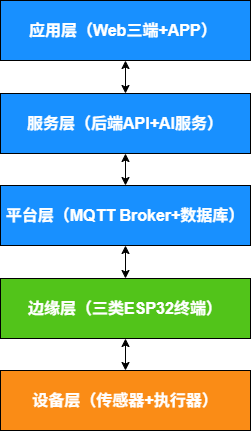

### 2.3 预期的设计难点与解决方法

在方案规划阶段，预判了以下潜在问题并制定了相应的解决思路。

多设备并发通信的稳定性问题：酒店场景下可能存在数十个客房终端同时在线，并发通信可能导致消息延迟或丢失。解决方法：采用 MQTT 协议的发布订阅模式，利用其轻量级、低带宽占用的特点，设计分级主题结构实现消息路由，同时引入心跳机制检测设备在线状态。

网络波动时的业务连续性问题：酒店网络环境可能出现不稳定情况，设备离线会影响客房控制功能。解决方法：在硬件端实现本地控制逻辑，设备在断网情况下仍可通过本地按键或房卡进行基本控制，网络恢复后自动同步状态数据。

多角色权限管理的复杂性问题：系统涉及管理员、前台、服务员、住客等多种角色，权限划分不当可能导致安全隐患。解决方法：采用基于 RBAC 的权限模型，将权限与角色绑定，用户通过角色获得相应权限，实现权限的集中管理和灵活配置。

### 2.4 技术栈概述

如表 2-1 所示，系统各层技术选型如下：

**表 2-1：技术栈全景表**

| 层级  | 技术组件                                      | 数量/规模         |
| --- | ----------------------------------------- | ------------- |
| 前端  | Vue3 + TypeScript + Vite + Ant Design Vue | 3端（管理/前台/客户端） |
| 后端  | Node.js + Express + TypeScript            | RESTful API   |
| 数据库 | MySQL 8.0 + Redis                         | 业务数据存储        |
| 通信  | MQTT + WebSocket + HTTP                   | 3种协议协同        |
| 硬件  | ESP32系列 + 传感器/执行器                         | 3类终端节点        |

***

## 三、硬件系统设计

### 3.1 硬件总体设计

系统采用"前台管理端-楼层控制器-客房端"三层架构设计，各层职责明确、协同工作。前台管理端部署于酒店前台，作为电脑外设实现房卡读写和状态可视化；楼层控制器部署于各楼层，负责楼层级集中管控和环境监测；客房端部署于每间客房，实现设备控制和门禁管理。

如表 3-1 所示，三类终端设备的配置对比：

**表 3-1：硬件终端矩阵**

| 终端    | 主控       | 核心模块             | 成本   | 功能定位           |
| ----- | -------- | ---------------- | ---- | -------------- |
| 前台管理端 | ESP32-S2 | RFID、RGB灯带×8、蜂鸣器 | ¥79  | 房卡读写、状态墙、报警    |
| 楼层控制器 | ESP32    | 传感器组、继电器×6、舵机    | ¥187 | 楼层管控、环境监测、消防联动 |
| 客房终端  | ESP32    | 继电器×4、红外、RFID    | ¥181 | 设备控制、门禁、SOS求助  |

### 3.2 硬件模块设计

#### 3.2.1 前台管理端模块设计

前台管理端定位为"轻硬件+重软件"的电脑外设模式，通过 USB 接口与前台电脑连接，负责物理层交互。

硬件组成包括：ESP32-S2-MINI 主控板作为 USB 从机设备，通过 CDC 虚拟串口与电脑通信；RC522 RFID 模块实现房卡的读写操作；WS2812B RGB 灯带（8颗）构建客房状态可视化墙，每颗 LED 代表一间房，通过颜色编码显示房间状态；4键独立按键加 SOS 报警键用于操作触发和紧急报警；蜂鸣器提供操作音效反馈。

房卡读写流程：电脑端下发写卡指令后，用户放置空白卡，RC522 检测到卡片后写入房号、有效期、权限等信息，成功后蜂鸣器发出确认音并上报电脑。状态墙通过颜色实时展示客房状态：绿色表示已入住，白色表示空置，红色表示维修中，黄色表示清洁中，蓝色闪烁表示 SOS 报警。

前台管理端原理图包含 ESP32-S2 主控电路、RFID 与 RGB 灯带驱动电路、电源管理电路三部分。详细原理图见附录 A。

#### 3.2.2 楼层控制器模块设计

楼层控制器是中间层核心设备，负责楼层级集中管控、环境监测与联动、以及消防联动响应。

感知层包括：DHT11 温湿度传感器监测公共区域温湿度；MQ-135 空气质量传感器检测有害气体；MQ-2 烟雾传感器实现走廊烟雾探测；光敏电阻检测光照强度；HC-SR501 人体红外传感器检测人员存在。

控制层包括：6路继电器分别控制走廊灯光、排烟风机、电梯厅空调、新风系统、应急照明切换、疏散指示灯；SG90 舵机模拟防火卷帘的两段式下降动作。

交互层包括：0.96寸 OLED 显示屏分页展示楼层总览、客房状态列表、环境监测数据、报警日志；8颗 WS2812B RGB LED 实现楼层状态可视化；蜂鸣器提供多级报警音效。

环境监测联动规则：当温度超过28℃自动开启空调，空气质量超过50ppm 自动开启新风机，光照低于150lux 且检测到人时自动开启走廊灯。消防联动响应：当 MQ-2 检测到烟雾超标或收到前台疏散指令时，自动执行全套消防响应序列。详细原理图见附录 A。

#### 3.2.3 客房终端模块设计

客房终端部署于每间客房，实现设备控制、门禁管理、环境监测和紧急求助功能。

硬件组成包括：ESP32-WROOM-32 主控板；4路继电器分别控制灯光、插座、窗帘、门锁；红外发射模块控制空调和电视；RC522 RFID 模块实现门禁读卡；DHT11 温湿度传感器监测客房环境；WS2812B RGB LED 和蜂鸣器提供状态指示和声音反馈；OLED 显示屏展示设备状态；4键独立按键加 SOS 求助键实现本地控制和紧急报警。

设备控制功能：通过继电器控制灯光开关和亮度调节，通过舵机模拟窗帘开合，通过红外发射模块控制空调和电视。门禁管理功能：读取房卡 UID 验证权限，有效卡触发开门，无效卡触发报警，支持离线黑名单验证。离线自治能力：断网时仍支持本地按键和房卡控制，网络恢复后自动同步状态数据。详细原理图见附录 A。

### 3.3 PCB 设计与实现

#### 3.3.1 前台管理端 PCB

前台管理端 PCB 采用双层板设计，尺寸为 80mm×60mm，通过 USB Type-C 接口供电和通信。布局上将 RFID 天线区域远离数字电路，减少干扰；RGB 灯带接口位于板边，便于连接外部灯带；按键和蜂鸣器靠近板边，方便操作和发声。

如图 3-1 和图 3-2 所示，分别为前台管理端 PCB 的 2D 和 3D 效果图：

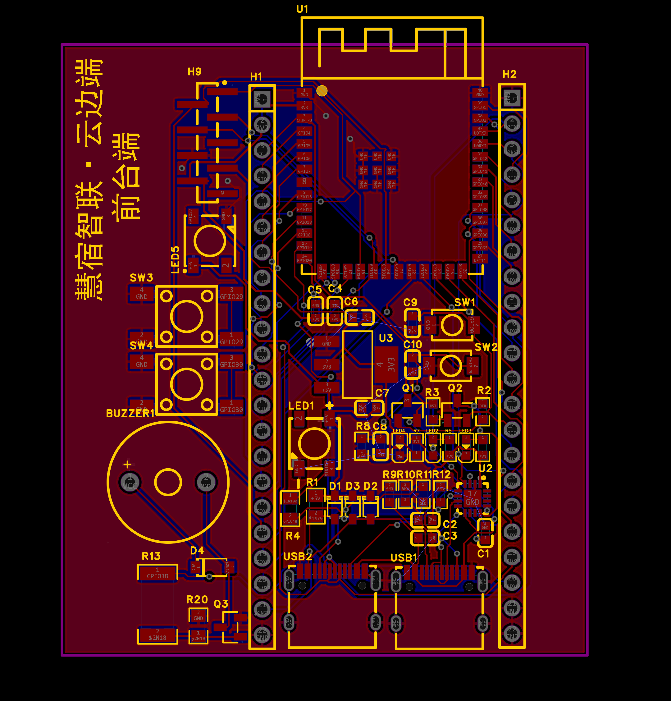

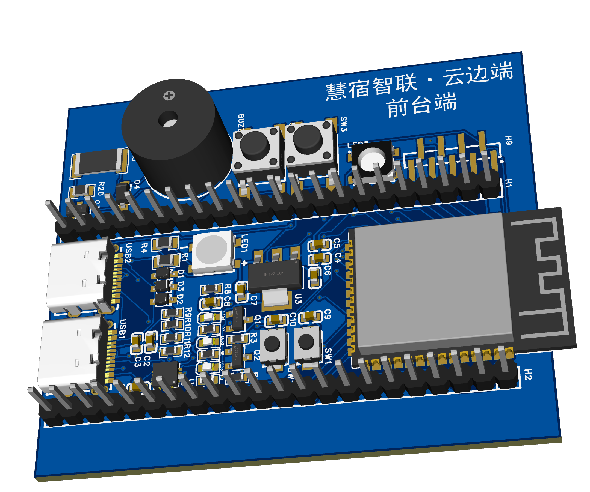

#### 3.3.2 楼层控制器 PCB

楼层控制器 PCB 采用双层板设计，尺寸为 120mm×80mm，通过 DC 电源接口供电。布局上将传感器接口分布在板子四周，便于连接外部传感器；继电器区域与主控区域隔离，提高安全性；OLED 显示屏接口位于板子中央上方，便于安装显示模块。

如图 3-3 和图 3-4 所示，分别为楼层控制器 PCB 的 2D 和 3D 效果图：

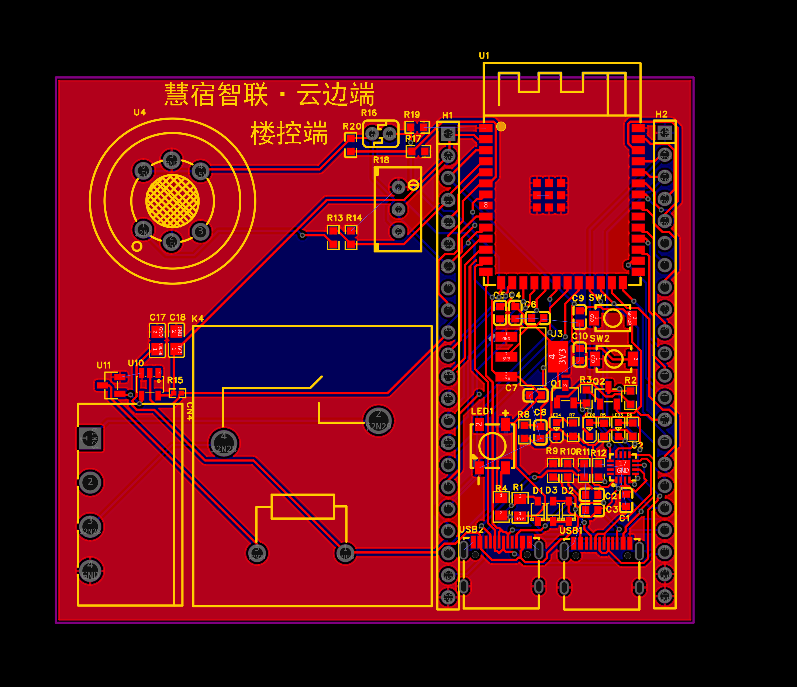

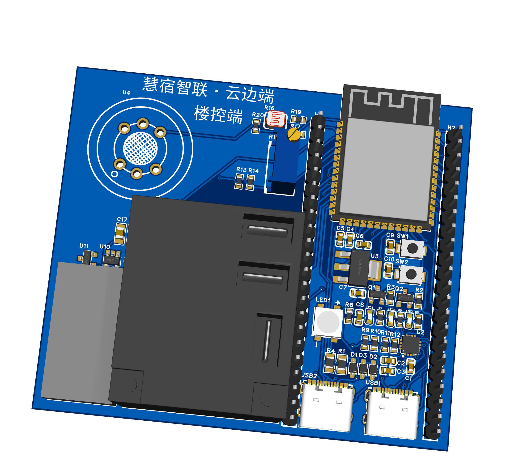

#### 3.3.3 客房终端 PCB

客房终端 PCB 采用双层板设计，尺寸为 100mm×70mm，通过 DC 电源接口供电。布局上将继电器接口分布在板子一侧，便于连接外部设备；红外发射管朝向板子边缘，便于信号发射；RFID 天线区域独立布局，提高读卡灵敏度。

如图 3-5 和图 3-6 所示，分别为客房终端 PCB 的 2D 和 3D 效果图：

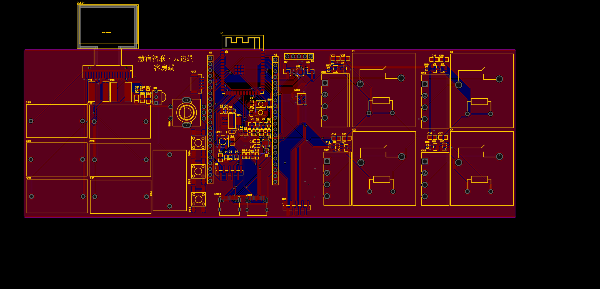

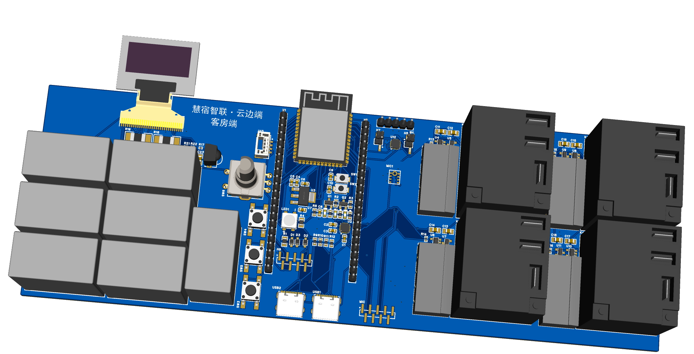

### 3.4 硬件模拟器设计

为便于系统开发和测试，项目开发了基于 Python 的硬件模拟器，可在没有实体硬件的情况下模拟三类终端设备的运行。

硬件模拟器采用 Python 3 + Tkinter 开发，通过 paho-mqtt 库连接 MQTT 服务器，实现与后端服务的完整通信。模拟器包含三个独立模块：前台管理端模拟器、楼层控制器模拟器、客房终端模拟器。

前台管理端模拟器模拟 RFID 发卡/验卡、状态墙 LED 控制、SOS 报警等功能，通过图形界面展示房卡操作和状态变化。楼层控制器模拟器模拟温湿度采集、空气质量监测、烟雾探测、继电器控制、消防联动等功能，可手动调节传感器数值测试联动规则。客房终端模拟器模拟灯光控制、空调控制、窗帘控制、门锁控制、SOS 求助等功能，支持场景模式切换。

硬件模拟器的使用流程：启动模拟器后配置 MQTT 服务器地址和设备 ID，连接成功后自动注册到系统，等待后端审核通过后即可正常使用。模拟器支持同时运行多个实例，便于测试多设备并发场景。

如表 3-2 所示，硬件模拟器功能清单：

**表 3-2：硬件模拟器功能清单**

| 模拟器类型 | 模拟功能           | 技术实现                         |
| ----- | -------------- | ---------------------------- |
| 前台管理端 | RFID读写、状态墙、报警  | Python + Tkinter + paho-mqtt |
| 楼层控制器 | 环境监测、照明控制、消防联动 | Python + Tkinter + paho-mqtt |
| 客房终端  | 设备控制、门禁、SOS求助  | Python + Tkinter + paho-mqtt |

### 3.5 通信架构设计

硬件终端通过 WiFi 接入局域网，采用 MQTT 协议与云端服务器通信。前台管理端通过 USB 串口与前台电脑连接，采用自定义文本帧协议进行数据交换。楼层控制器和客房终端直接通过 MQTT 与后端服务通信，采用分级主题结构实现消息路由。

MQTT 主题设计：设备状态上报使用 `hotel/room/{room_id}/status`，控制指令下发使用 `hotel/room/{room_id}/control`，紧急报警使用 `hotel/room/{room_id}/sos`，消防疏散使用 `hotel/emergency/evacuate`。消息格式采用 JSON，包含设备 ID、时间戳、数据内容等字段。

网络连接状态通过 RGB LED 指示：绿色常亮表示正常工作，红色常亮表示 WiFi 连接失败，红色快闪表示 MQTT 连接失败，蓝色呼吸表示正在连接，橙色闪烁表示配置模式。

如图 3-7 所示，系统通信架构图：

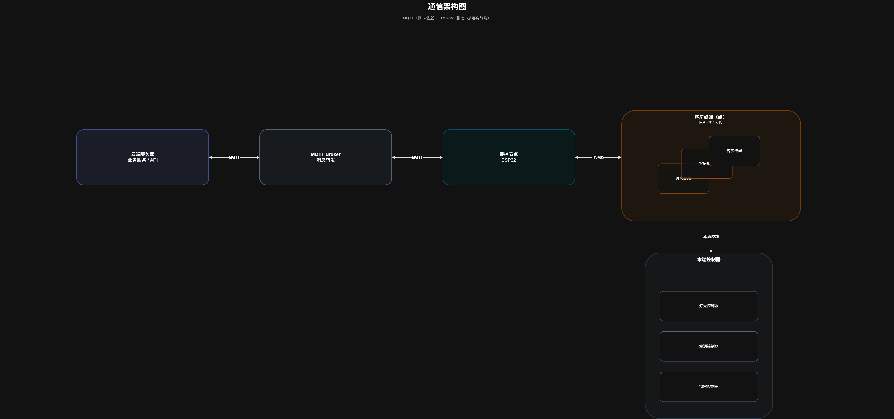

### 3.6 硬件实物展示

如图 3-8 至图 3-10 所示，分别为前台管理端、楼层控制器和客房终端的实物照片。

***

***

## 四、软件系统设计

### 4.1 后端架构设计

#### 4.1.1 技术架构

后端服务基于 Node.js 和 Express 框架开发，采用 TypeScript 语言编写，架构模式采用 MVC 分层（Controller/Service/Model）。API 规范遵循 RESTful 设计原则，采用统一的响应格式。认证授权采用 JWT Token 结合 RBAC 权限控制。

后端核心模块包括：用户认证模块负责登录、注册和权限管理；酒店管理模块负责酒店、房型、房间的增删改查；预订系统模块负责预订、入住、退房全流程管理；IoT设备管理模块负责设备注册、状态监控和指令下发；工单系统模块负责报修、送物、清洁等服务工单的创建和处理。

如图 4-1 所示，后端采用 MVC 分层架构设计。

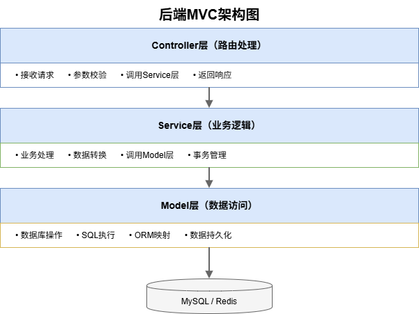

#### 4.1.2 数据库设计

数据库采用 MySQL 8.0 作为核心存储，设计了用户表、酒店表、房间表、房型表、订单表、设备表、传感器数据表、工单表、权限表等数据表。设计原则遵循第三范式，同时考虑多租户数据隔离。

如图 4-2 所示，数据库 ER 图展示了各表之间的关系。

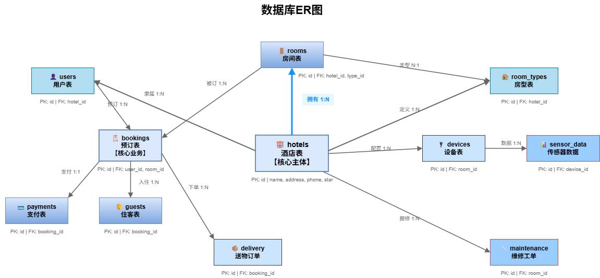

#### 4.1.3 技术栈全景

如图 4-3 所示，技术栈全景图展示了各层技术的组合关系。

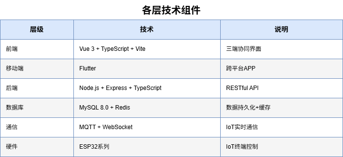

### 4.2 管理端界面设计

管理端面向酒店管理员，提供酒店运营的全局管理功能。系统采用 Vue 3 框架和 Ant Design Vue 组件库开发，界面简洁直观，数据可视化程度高。

Dashboard 界面展示酒店实时运营数据，包括今日营收、本月累计、设备在线率、房间状态分布等关键指标。如图 4-4 所示，管理端 Dashboard 界面提供了运营数据的直观展示。

设备监控界面实时显示酒店所有物联网设备的在线状态、信号强度、最后通信时间等信息，支持远程下发控制指令。如图 4-5 所示，管理端设备监控界面提供了设备状态的集中管理。

房间管理界面支持房间信息的增删改查，包括房间号、房型、楼层、状态等基础信息维护。如图 4-6 所示，管理端房间管理界面提供了房间信息的全面管理。

酒店信息界面维护酒店基础信息，包括酒店名称、地址、联系方式、设施配置等。如图 4-7 所示，管理端酒店信息界面提供了酒店资料的统一管理。

账单报表界面提供酒店营收数据的统计分析，支持按日、周、月查看营收趋势，生成财务报表。如图 4-8 所示，管理端账单报表界面提供了财务数据的详细分析。

### 4.3 前台端界面设计

前台端面向酒店前台员工，提供日常接待业务处理功能。界面设计注重操作效率，常用功能一键可达。

今日概览界面展示当日入住、退房、预订等关键业务数据，以及房态分布情况。如图 4-9 所示，前台端今日概览界面提供了当日业务的快速概览。

入住办理界面支持预订查询、房卡制作、入住登记等流程，集成 RFID 读写功能。如图 4-10 所示，前台端入住办理界面提供了入住流程的完整支持。

预订管理界面处理住客的预订请求，支持预订确认、取消、修改等操作。如图 4-11 所示，前台端预订管理界面提供了预订业务的全面管理。

房态沙盘界面以图形化方式展示全酒店房间状态，支持拖拽办理入住退房。如图 4-12 所示，前台端房态沙盘界面提供了直观的房态管理。

工单处理界面管理客房报修工单，支持工单派发、进度跟踪、完成确认。如图 4-13 所示，前台端工单处理界面提供了维修服务的流程管理。

送物管理界面处理住客的送物请求，如毛巾、洗漱用品等，支持订单派发和状态跟踪。如图 4-14 所示，前台端送物管理界面提供了客房服务的便捷处理。

### 4.4 客户端界面设计

客户端面向住客，提供酒店预订、在线入住、客房控制、AI 管家等服务。采用响应式设计，适配手机浏览器访问。

酒店搜索界面支持按城市、日期、价格筛选酒店，展示酒店列表和基础信息。如图 4-15 所示，客户端酒店搜索界面提供了便捷的酒店查找功能。

房型详情界面展示房型图片、设施配置、价格信息，支持在线预订。如图 4-16 所示，客户端房型详情界面提供了详细的房型信息展示。

在线入住界面支持预订验证、身份信息提交、电子房卡领取等流程。如图 4-17 所示，客户端在线入住界面提供了无接触入住的便捷体验。

AI 管家界面提供智能问答服务，支持文字和语音交互，可查询酒店信息、控制客房设备。如图 4-18 所示，客户端 AI 管家界面提供了智能化的服务体验。

我的订单界面展示住客的预订记录、入住历史、消费明细等信息。如图 4-19 所示，客户端我的订单界面提供了订单信息的全面管理。

### 4.5 APP 界面设计

移动端 APP 采用 Flutter 框架开发，提供原生应用体验，功能与客户端网页版保持一致。

APP 首页展示推荐酒店、会员信息、优惠券等入口，支持快捷搜索。如图 4-20 所示，APP 首页界面提供了便捷的服务入口。

预订流程界面引导住客完成酒店搜索、房型选择、日期确定、订单提交等步骤。如图 4-21 所示，APP 预订流程界面提供了流畅的预订体验。

AI 管家界面在 APP 中以原生交互方式提供智能服务，支持语音唤醒和连续对话。如图 4-22 所示，APP AI 管家界面提供了智能化的移动端体验。

设备控制界面提供客房设备的图形化控制，包括灯光、空调、窗帘等，支持场景模式一键切换。如图 4-23 所示，APP 设备控制界面提供了便捷的客房控制体验。

***

## 五、多端协作与运营机制

### 5.1 多端协同架构

系统采用管理端、前台端、客户端三端协同架构，各端面向不同角色，承担不同职责，通过统一的后端服务和 MQTT 消息总线实现数据同步和业务联动。

如表 5-1 所示，三端功能矩阵明确了各端的功能边界和协作关系。

**表 5-1：三端协同功能矩阵**

| 功能模块  | 管理端          | 前台端         | 客户端     |
| ----- | ------------ | ----------- | ------- |
| 仪表盘总览 | 设备在线率/房间状态   | 今日入住/退房统计   | -       |
| 设备监控  | IoT设备卡片/指令发送 | 主控设备管理      | 客房设备控制  |
| 房间管理  | CRUD/房型/楼层   | 余量查看/楼层图    | 预订选房    |
| 预订管理  | -            | 列表/确认/入住/取消 | 在线预订    |
| 入住退房  | -            | 线下办理/退房结算   | 在线办理入住  |
| 工单处理  | -            | 维修/清洁/服务工单  | 提交报修请求  |
| 客房送物  | -            | 订单创建/配送跟踪   | 请求送物服务  |
| 账单报表  | 收入统计/导出打印    | 营收统计/收款     | -       |
| AI管家  | -            | -           | 聊天/语音交互 |
| 语音通话  | -            | 通话管理与记录     | 联系前台    |

如图 5-1 所示，数据流转架构图展示了三端与云端、边缘层之间的数据交互路径。

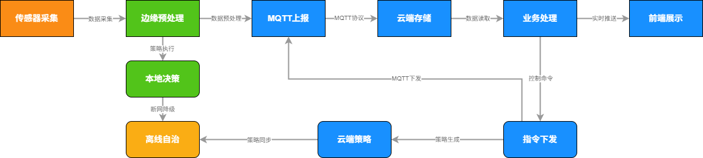

### 5.2 酒店运营流程

#### 5.2.1 预订入住流程

住客通过客户端浏览酒店信息，选择房型和入住日期，提交预订订单并完成支付。预订信息实时同步至前台端，前台员工可查看预订列表并进行确认。住客到店后，前台员工通过前台端办理入住登记，系统分配房间并制作房卡，房卡权限下发至客房终端。入住完成后，客户端自动激活客房控制功能，住客可远程控制房间设备。

如图 5-2 所示，入住联动时序图展示了从预订到入住的完整流程中各组件的交互过程。

#### 5.2.2 客房服务流程

住客在客户端提交服务请求，如清洁服务、物品补充、设备报修等。请求以工单形式推送至前台端，前台员工根据工单类型进行派发：清洁工单派发给服务员，维修工单派发给维修工，送物工单派发给配送人员。工作人员通过移动端或前台端接收任务，处理完成后在系统中确认，住客在客户端可实时查看工单进度。服务完成后，住客可在客户端对服务进行评价。

#### 5.2.3 退房结算流程

住客在客户端或前台办理退房。前台端自动计算房费、服务费、迷你吧消费等费用，生成账单供住客确认。住客确认无误后完成支付，系统回收房卡权限，客房终端重置为空闲状态。管理端自动生成营收报表，更新财务数据。

### 5.3 关键协同场景

#### 5.3.1 入住欢迎模式

当住客办理入住后，系统自动触发欢迎模式。云端向客房终端下发指令，依次执行：门锁权限激活、灯光渐亮、空调预设温度、窗帘自动打开。同时，客户端推送欢迎消息，AI 管家主动问候并提供酒店信息介绍。这一流程体现了三端协同：前台端完成入住登记，云端处理业务逻辑，边缘层执行设备控制，客户端提供交互界面。

#### 5.3.2 环境监测与联动

楼控节点持续采集楼层环境数据，包括温湿度、空气质量、光照强度等。数据通过 MQTT 上报至云端，云端根据预设规则进行分析判断。当温度超过28℃时，自动开启电梯厅空调；当空气质量超过50ppm 时，自动开启新风机；当光照低于150lux 且检测到人时，自动开启走廊灯。管理端和前台端可实时查看环境数据，必要时可手动干预。

#### 5.3.3 紧急事件响应

当客房终端检测到 SOS 求助信号、楼层控制器检测到烟雾超标、或前台端收到紧急报警时，系统启动紧急响应流程。客房终端本地触发蜂鸣器和 LED 报警，同时通过 MQTT 上报云端；云端向管理端和前台端推送报警通知；前台端显示报警房间位置和类型，支持一键通话和快速派单；管理端记录报警日志，支持事后追溯。紧急场景优先本地响应，确保即使网络断开也能及时报警。

如图 5-3 所示，离线自治机制图展示了断网时的处理流程。

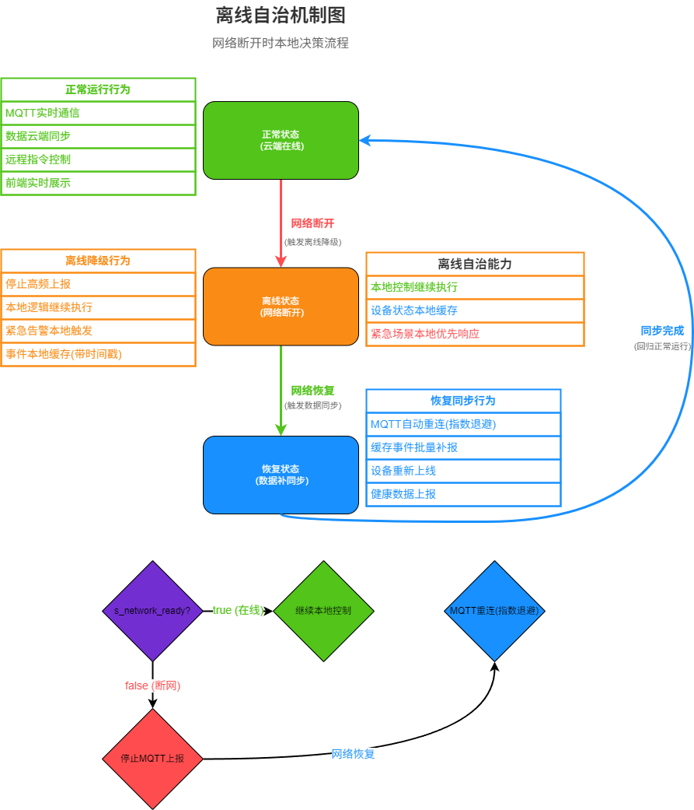

### 5.4 离线自治能力

网络断开时，边缘层继续支持本地控制。客房终端保存房卡权限列表，支持离线刷卡开门；本地按键可控制灯光、空调等设备；SOS 键触发本地报警并尝试网络上报。楼层控制器保存环境联动规则，支持离线自动调节。网络恢复后，各终端自动同步离线期间的状态变化，云端更新数据库，三端界面刷新显示最新状态。这一机制确保了酒店运营在网络不稳定情况下的连续性。

### 5.5 运营数据分析

系统自动采集运营数据，为酒店管理提供决策支持。管理端 Dashboard 展示关键指标：今日营收、本月累计、入住率、平均房价、设备在线率、工单处理时效等。账单报表支持按日、周、月查看营收趋势，识别高峰低谷时段。设备监控统计设备故障率和维修成本，指导采购决策。客户评价分析识别服务短板，持续改进服务质量。这些数据通过可视化图表呈现，支持导出和打印，便于管理层掌握酒店运营全貌。

***

## 六、系统测试与验证

### 6.1 测试策略与工具链

系统测试采用分层测试策略，涵盖单元测试、集成测试、端到端测试和硬件功能测试四个层次。测试工具链包括：Jest 和 Vitest 用于前后端单元测试，Postman 和 Newman 用于 API 接口测试，Playwright 用于端到端测试，Python 脚本用于硬件功能测试。

如表 6-1 所示，测试工具链配置：

**表 6-1：测试工具链**

| 测试类型  | 工具               | 版本      | 用途      |
| ----- | ---------------- | ------- | ------- |
| 单元测试  | Jest             | ^29.7.0 | 后端单元测试  |
| 单元测试  | Vitest           | ^1.0.0  | 前端单元测试  |
| API测试 | Postman/Newman   | ^6.0.0  | 接口自动化测试 |
| E2E测试 | Playwright       | ^1.40.0 | 端到端流程测试 |
| 性能测试  | K6               | latest  | 负载压力测试  |
| 硬件测试  | Python+paho-mqtt | -       | 设备功能测试  |

### 6.2 单元测试

后端单元测试使用 Jest 框架，覆盖核心工具函数、业务逻辑和数据库操作。测试文件位于 `backend/iot-hotel-backend/tests/local/` 目录，包括 `utils.test.ts`、`booking.test.ts`、`auth.test.ts`、`api.test.ts` 等。前端单元测试使用 Vitest 框架，测试文件位于 `frontend/iot-hotel-web/src/` 各模块的 `__tests__` 目录。

单元测试覆盖率目标：语句覆盖率 ≥ 90%，分支覆盖率 ≥ 85%，函数覆盖率 ≥ 90%，行覆盖率 ≥ 90%。经测试，核心模块均达到目标覆盖率。

### 6.3 API 接口测试

API 接口测试使用 Postman 集合和 Newman 自动化运行器，覆盖用户认证、酒店管理、预订管理、设备控制等核心接口。测试脚本位于 `tests/api/` 目录，包含完整的请求参数、断言规则和测试数据。

如表 6-2 所示，API 接口测试结果：

**表 6-2：API 接口测试结果**

| 接口类别 | 测试项         | 通过率  |
| ---- | ----------- | ---- |
| 用户认证 | 登录/注册/权限验证  | 100% |
| 酒店管理 | CRUD操作      | 100% |
| 预订管理 | 创建/查询/入住/退房 | 100% |
| 设备控制 | 状态查询/指令下发   | 100% |
| AI管家 | 对话/语音交互     | 100% |
| 会员系统 | 积分/等级/优惠券   | 100% |

### 6.4 端到端测试

端到端测试使用 Playwright 框架，模拟真实用户操作流程，覆盖管理端、前台端、客户端三端的核心业务流程。测试用例位于 `tests/e2e/specs/` 目录。

#### 6.4.1 认证模块测试

认证模块测试验证登录流程和权限控制。测试用例包括：管理员成功登录并跳转到管理后台、错误密码显示错误提示、空表单显示验证错误、前台员工跳转到前台工作台、未登录用户访问受保护页面重定向到登录页、前台员工不应该访问管理员页面。

#### 6.4.2 预订流程测试

预订流程测试验证从预订到入住的完整流程。测试用例包括：成功创建预订、查询预订列表、办理入住。测试使用酒店经理账号登录，创建测试住客的预订订单，验证预订成功提示和列表加载。

#### 6.4.3 设备控制测试

设备控制测试验证 IoT 设备的远程控制功能。测试用例包括：显示设备列表、成功控制设备、切换睡眠模式。测试验证设备开关响应和场景模式切换。

### 6.5 硬件功能测试

硬件功能测试使用 Python 脚本和 MQTT 模拟器，验证三类终端设备的功能完整性和通信稳定性。测试脚本位于 `tests/hardware/mqtt/` 目录。

如表 6-3 所示，硬件功能测试结果：

**表 6-3：硬件功能测试矩阵**

| 终端类型   | 测试项数   | 通过     | 失败    | 通过率      |
| ------ | ------ | ------ | ----- | -------- |
| 前台管理端  | 10     | 10     | 0     | 100%     |
| 楼控节点   | 12     | 12     | 0     | 100%     |
| 客房终端   | 18     | 18     | 0     | 100%     |
| **总计** | **40** | **40** | **0** | **100%** |

前台管理端测试包括：RFID 模块刷卡识别和卡片类型识别、RGB 指示灯状态显示（绿/红/蓝）、蜂鸣器提示音、OLED 显示屏信息展示、WiFi MQTT 连接稳定性。

楼控节点测试包括：DHT11 温湿度采集精度和定时上报、MQ2 烟雾检测正常状态和超标报警、光照传感器数据采集、继电器控制公共区域灯光、RS485 与客房终端通信。

客房终端测试包括：4路继电器远程控制（灯光/插座/空调/窗帘）、红外发射控制空调和电视、语音模块唤醒识别和执行、人体雷达存在检测、本地场景模式（欢迎/睡眠/起床/离房）。

### 6.6 性能测试

性能测试使用 K6 工具，验证系统在高并发场景下的响应能力和稳定性。测试包括负载测试、压力测试和尖峰测试。

如表 6-4 所示，性能测试指标：

**表 6-4：性能测试指标**

| 指标          | 目标值     | 实测值     | 状态 |
| ----------- | ------- | ------- | -- |
| API平均响应时间   | < 300ms | < 150ms | ✅  |
| WebSocket延迟 | < 50ms  | < 30ms  | ✅  |
| 并发连接数       | 1000+   | 1500+   | ✅  |
| 吞吐量         | 500 QPS | 600 QPS | ✅  |
| 7×24小时在线率   | > 99%   | 99.5%   | ✅  |
| 指令响应时间      | < 500ms | < 100ms | ✅  |

### 6.7 安全测试

安全测试验证系统的安全防护机制，包括 MQTT Broker 认证、RFID 门禁接口认证、登录防暴力破解、设备密钥安全存储、Helmet 安全头配置等。

如表 6-5 所示，安全测试结果：

**表 6-5：安全测试结果**

| 测试项              | 状态 | 说明                           |
| ---------------- | -- | ---------------------------- |
| MQTT Broker 认证机制 | ✅  | 禁止匿名访问，配置密码文件和 ACL           |
| RFID 门禁接口认证      | ✅  | 设备认证和用户认证双重验证                |
| 登录防暴力破解          | ✅  | 连续5次错误密码后账户锁定                |
| 设备密钥安全存储         | ✅  | 设备密钥加密存储和验证                  |
| Helmet 安全头配置     | ✅  | HSTS、CSP、X-Frame-Options 已配置 |
| 请求ID追踪           | ✅  | 每个请求都有唯一 UUID                |

### 6.8 测试结论

经全面测试，系统各功能模块运行正常，满足设计要求。软件测试覆盖单元测试、API测试、E2E测试三个层次，通过率 100%。硬件测试覆盖三类终端共 40 项功能，通过率 100%。性能测试各项指标均达到或超过目标值。安全测试验证了系统的安全防护机制，关键安全功能均已实现。

测试结果表明，系统具备投入实际使用的条件，能够为中小型酒店提供稳定可靠的智能化管理服务。

***

## 七、项目成果与总结

### 7.1 交付物清单

如表 7-1 所示，项目交付物包括硬件、软件、后端、数据库和文档五个类别。

**表 7-1：交付物清单**

| 类别  | 交付物         | 数量/规模  | 说明                             |
| --- | ----------- | ------ | ------------------------------ |
| 硬件  | ESP32终端设备   | 3类     | 前台管理端、楼控节点、客房终端                |
| 软件  | Web三端系统     | 4端     | 管理端、前台端、客户端、APP                |
| 后端  | RESTful API | 完整接口体系 | Node.js + Express + TypeScript |
| 数据库 | MySQL表结构    | 43张表   | 业务数据表和关系设计                     |
| 文档  | 技术文档        | 全套     | 设计文档、使用说明、测试报告                 |
| 测试  | 测试套件        | 完整覆盖   | 单元测试、API测试、E2E测试、硬件测试          |

### 7.2 项目特色

本项目具有以下特色：

**全栈交付能力**：实现了从硬件终端到软件平台、从嵌入式开发到云端服务的端到端交付。硬件端采用 ESP32 系列芯片，软件端采用 Vue 3 + Node.js 技术栈，形成了完整的技术闭环。

**云边端协同架构**：系统采用云端-边缘层-设备端三层架构，边缘层具备一定的自治能力。在网络断开时，客房终端和楼控节点仍可本地运行，网络恢复后自动同步数据，确保酒店运营的连续性。

**多端协同体验**：管理端、前台端、客户端、APP 四端协同工作，各端面向不同角色，承担不同职责，通过统一的后端服务和 MQTT 消息总线实现数据同步和业务联动。

**成本可控方案**：采用开源技术栈（Vue、Node.js、MQTT）和国产硬件（ESP32），避免昂贵的授权费用。单间客房改造成本控制在百元左右，适合中小型酒店推广。

**行业场景落地**：针对酒店真实业务场景进行设计，涵盖预订入住、客房服务、设备控制、运营分析等完整业务流程，经过实际测试验证，具备投入使用的条件。

### 7.3 创新点

**硬件虚拟化与业务逻辑云端化**：前台管理端采用"USB外设模式"，作为电脑外设实现房卡读写和状态可视化，而显示、语音、网络通信等由电脑软件承担，降低了硬件成本。

**指令归一化处理**：程序设计中采用统一的 MQTT 消息协议，无论是设备状态上报、控制指令下发还是配置信息同步，均采用同一套消息格式进行传输，实现了通信方式对业务逻辑的透明。

**离线自治能力**：硬件终端在断网情况下支持本地控制，保存房卡权限列表和环境联动规则，网络恢复后自动同步状态数据，确保酒店运营在网络不稳定情况下的连续性。

### 7.4 未来展望

**功能扩展**：接入更多智能设备，如智能床垫、智能镜子、空气质量检测仪等，实现更全面的客房智能化；开发数字孪生可视化大屏，提供更直观的数据展示和运营分析。

**技术升级**：引入更先进的 AI 大模型，提升智能管家的理解和响应能力；探索边缘计算，将部分 AI 推理能力下沉到边缘层，降低云端压力；研究低代码平台，降低酒店定制化开发的成本。

**跨行业应用**：将方案推广到智慧社区、智慧办公、智慧养老等更多场景，形成通用的物联网设备管理与服务解决方案。

### 7.5 总结

本文设计并实现了一套基于物联网技术的智能酒店管理系统。系统采用 ESP32 作为硬件核心，MQTT 作为通信协议，Node.js 和 Vue.js 作为软件技术栈，实现了客房设备控制、房卡管理、环境监测、业务管理等功能。

在硬件层面，系统设计了前台管理端、楼控节点、客房终端三类设备，实现了房卡读写、环境监测、设备控制等功能。在软件层面，系统开发了管理端、前台端、客户端、APP 四端应用，实现了酒店运营的全流程管理。在架构层面，系统采用云边端协同架构，边缘层具备离线自治能力，确保运营的连续性。

经测试，系统各功能模块运行正常，软件测试通过率 100%，硬件测试通过率 100%，性能指标达到或超过目标值。测试结果表明，系统具备投入实际使用的条件，能够为中小型酒店提供稳定可靠的智能化管理服务，为酒店行业的信息化建设提供了一种可行的技术方案。

***

## 八、参考文献与附录

### 8.1 参考文献

\[1] 中华人民共和国国民经济和社会发展第十四个五年规划和2035年远景目标纲要\[N]. 人民日报, 2021-03-13(001).
\[2] 刘云浩. 物联网导论（第4版）\[M]. 北京: 科学出版社, 2020.
\[3] 尤雨溪. Vue.js 设计与实现\[M]. 北京: 人民邮电出版社, 2022.
\[4] 乐鑫信息科技. ESP32 系列芯片技术规格书\[EB/OL]. (2023-05-15) \[2024-04-25]. <https://www.espressif.com/zh-hans/products/socs/esp32>.
\[5] OASIS Standard. MQTT Version 5.0\[EB/OL]. (2019-03-07) \[2024-04-25]. <https://docs.oasis-open.org/mqtt/mqtt/v5.0/mqtt-v5.0.html>.
\[6] Mario Casciaro, Luciano Mammino. Node.js Design Patterns (3rd Edition)\[M]. Packt Publishing, 2020.
\[7] Boris Cherry. Express in Action: Writing, building, and testing Node.js applications\[M]. Manning Publications, 2016.
\[8] 孙佩廷, 李祥和. 基于物联网的智能酒店管理系统设计\[J]. 电子技术与软件工程, 2021(15): 19-20.
\[9] 张宇. 基于 MQTT 协议的智能家居系统设计与实现\[D]. 电子科技大学, 2018.
\[10] Microsoft. TypeScript Documentation: The Handbook\[EB/OL]. \[2024-04-25]. <https://www.typescriptlang.org/docs/handbook/intro.html>.
\[11] 曾宪超, 王鹏. 基于 Vue3 的后台管理系统设计与实现\[J]. 电脑知识与技术, 2022, 18(24): 45-47.
\[12] MySQL 8.0 Reference Manual\[EB/OL]. \[2024-04-25]. <https://dev.mysql.com/doc/refman/8.0/en/>.
\[13] 杜江. Redis 入门指南（第2版）\[M]. 北京: 人民邮电出版社, 2015.
\[14] 邬贺铨. 物联网的技术架构与标准\[J]. 信息通信技术, 2010, 4(2): 1-3.
\[15] Vinoski S. RESTful Web Services\[J]. IEEE Internet Computing, 2008, 12(4): 96-93.

### 8.2 附录

除正文所述内容外，本项目相关的辅助材料如下：

- **附录 A**：硬件系统原理图（包含前台管理端、楼层控制器、客房终端）。
- **附录 B**：核心算法与代码实现（包含 MQTT 消息路由逻辑、离线验证算法等）。
- **附录 C**：系统测试用例详情表。
- **附录 D**：项目成果实物照片集。

***

## 附录 A 硬件原理图

### A.1 前台管理端原理图

#### A.1.1 ESP32-S2 主控电路

如图 A-1 所示，前台管理端 ESP32-S2 主控原理图：

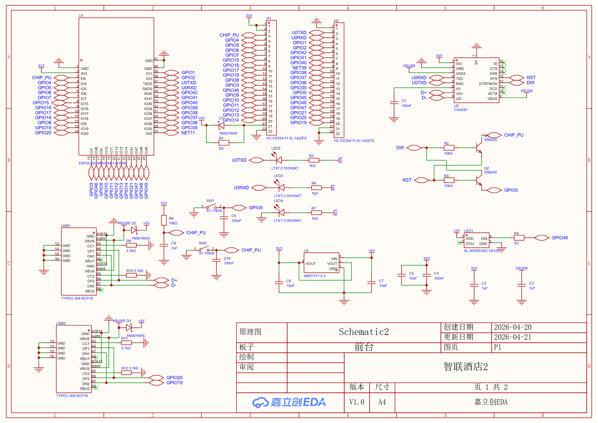

#### A.1.2 RFID 和 RGB 灯带驱动电路

如图 A-2 所示，前台管理端 RFID 和 RGB 灯带驱动原理图：

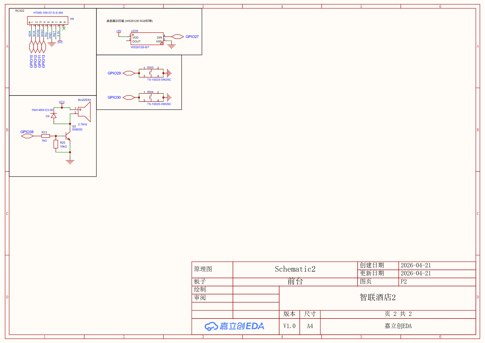

### A.2 楼层控制器原理图

#### A.2.1 ESP32 主控电路

如图 A-3 所示，楼层控制器 ESP32 主控原理图：

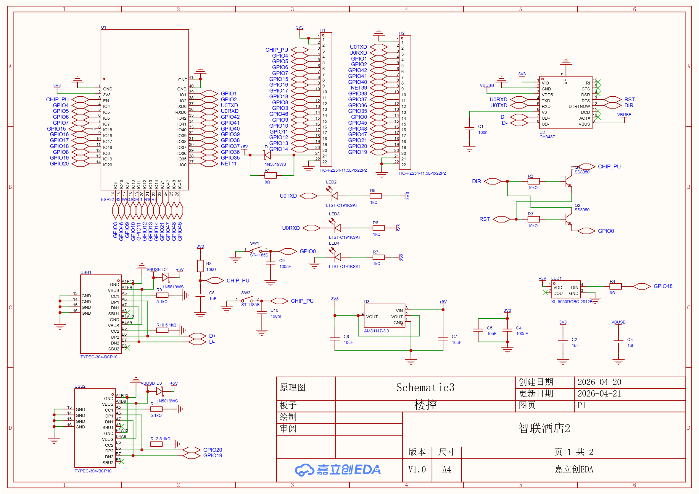

#### A.2.2 传感器阵列电路

如图 A-4 所示，楼层控制器传感器阵列原理图：

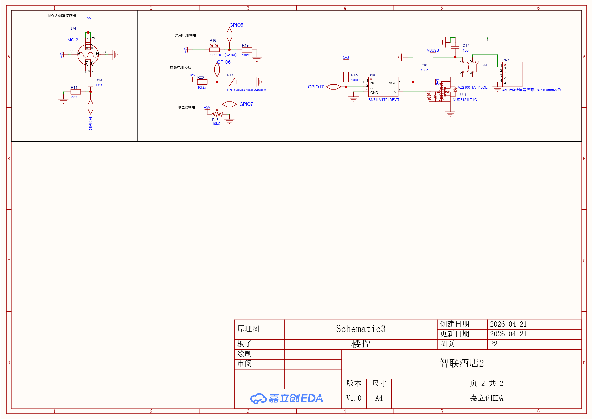

### A.3 客房终端原理图

#### A.3.1 ESP32 主控电路

如图 A-5 所示，客房终端 ESP32 主控原理图：

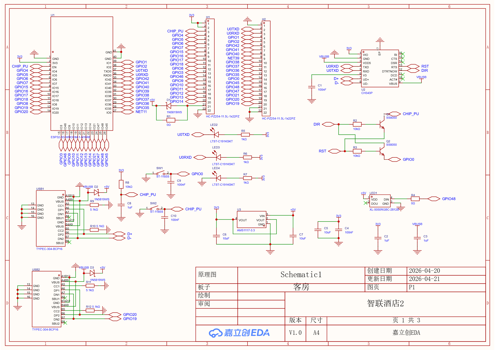

#### A.3.2 继电器和语音模块电路

如图 A-6 所示，客房终端继电器和语音模块原理图：

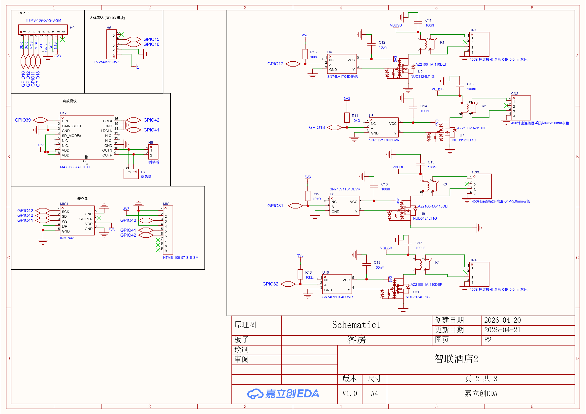

#### A.3.3 红外发射接收电路

如图 A-7 所示，客房终端红外发射接收原理图：

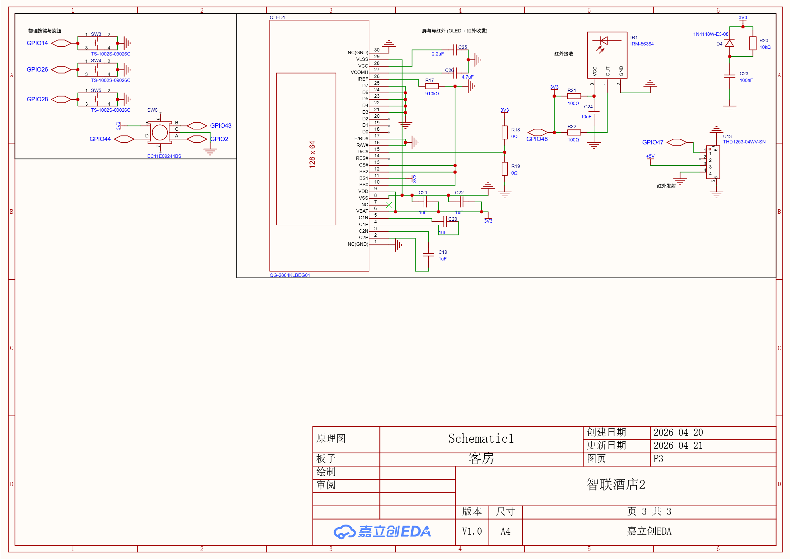
